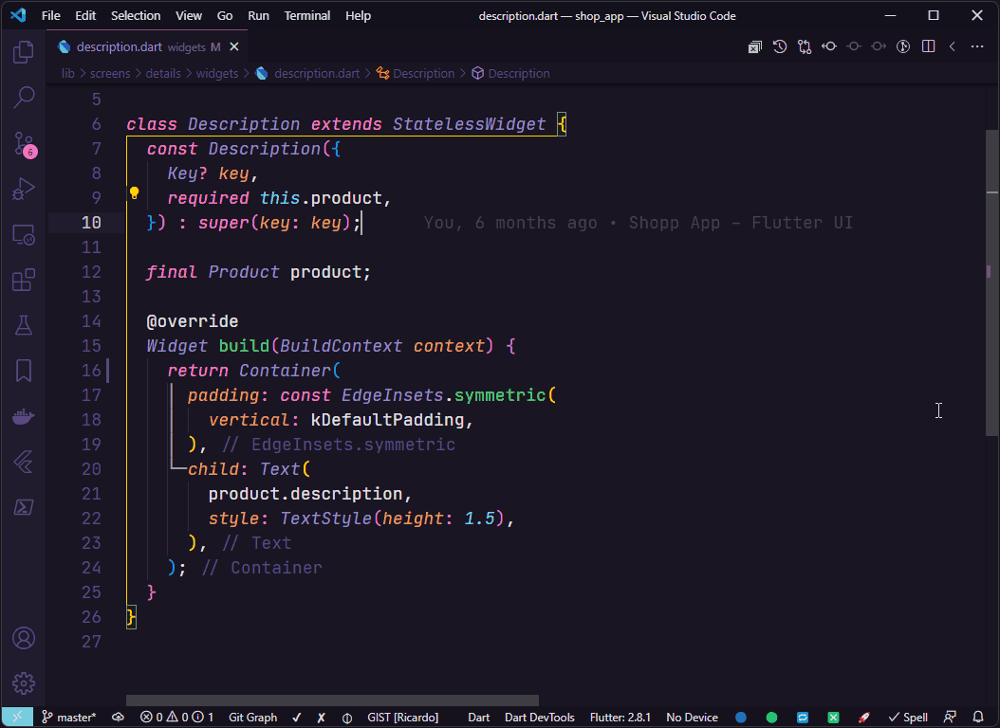
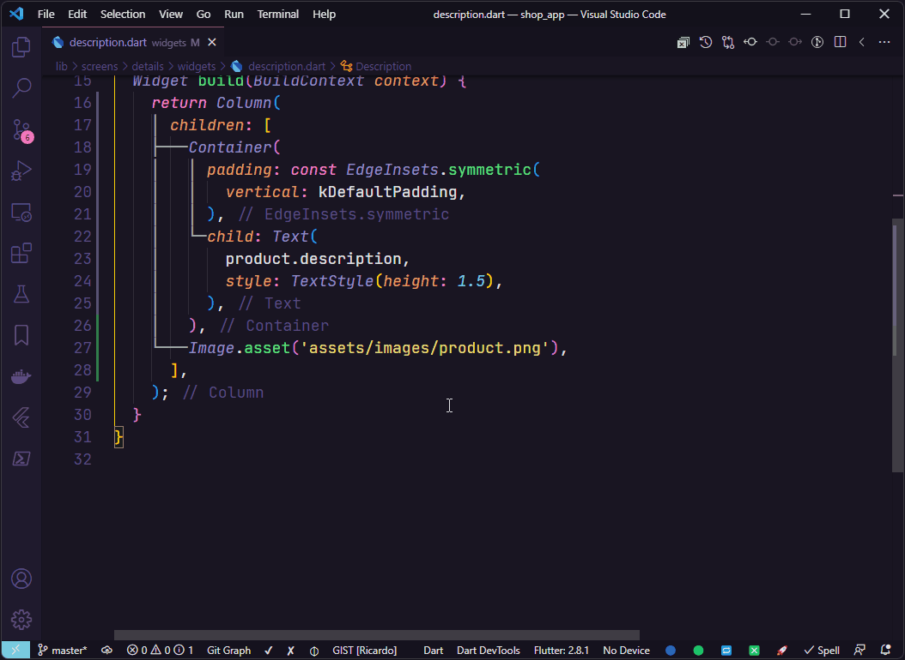

<p align="center">
  <br />
  <a title="Learn more about Create Flutter Widgets and Classes" href="https://github.com/ricardoemerson/create-flutter-widgets-and-classes">
    
    </a>
</p>

# Support

**Create Flutter Widgets and Classes** is an extension created for **Visual Studio Code**. If you find it useful, please consider supporting it.

<table align="center" width="60%" border="0">
  <tr>
    <td>
      <a title="PayPal" href="https://www.paypal.com/donate?hosted_button_id=X26H7L6AVMD96">
        Donate with PayPal
      </a>
    </td>
    <td>
      <a title="Mercado Pago" href="https://mpago.la/1LvP93a">
        Donate with Mercado Pago
      </a>
    </td>
  </tr>
</table>

# Create Flutter Widgets and Classes

[](https://marketplace.visualstudio.com/items?itemName=ricardo-emerson.create-flutter-widgets-and-classes)
[](https://marketplace.visualstudio.com/items?itemName=ricardo-emerson.create-flutter-widgets-and-classes)
[](https://marketplace.visualstudio.com/items?itemName=ricardo-emerson.create-flutter-widgets-and-classes)
[](https://marketplace.visualstudio.com/items?itemName=ricardo-emerson.create-flutter-widgets-and-classes&ssr=false#review-details)

This extension creates Flutter Stateless or Stateful Widgets, MobX Store, Classes, Interfaces, and you can also apply to existing widgets the following wrappers:

- `Wrap with Expanded`
- `Wrap with Stack`
- `Wrap with Positioned`
- `Wrap with Align`
- `Wrap with ClipRRect`
- `Wrap with Hero`
- `Wrap with GestureDetector`
- `Wrap with SingleChildScrollView`
- `Wrap with SafeArea`
- `Wrap with Form`
- `Wrap with Obx`
- `Wrap with Observer`

# Usage Examples

You can create a Flutter Stateless or Stateful Widgets, MobX Store, Classes and Intefaces either by typing in the vscode command palette or by right-clicking any folder in the tree view and use the followed options:

- `📄 Create Dart Interface`
- `📄 Create Dart Provider Interface`
- `📄 Create Dart Repository Interface`
- `📄 Create Dart Service Interface`
- `📝 Create Dart Class`
- `📝 Create Dart Controller Class`
- `📦 Create Mobx Store`
- `🔶 Create Flutter Stateless Widget`
- `🔷 Create Flutter Stateful Widget`

## All Commands (Ctrl+Shift+P or Cmd+Shift+P):


## Mouse Right Click:


## Create Flutter Stateless Widget Example:

Select the folder when the widget will be created and choose `🔶 Create Flutter Stateless Widget` and enter the name of the widget to be created.


## Create Flutter Stateful Widget Example:

Select the folder when the widget will be created and choose `🔷 Create Flutter Stateful Widget` and enter the name of the widget to be created.


## Create Dart Class Example:

Select the folder when the class will be created and choose `📝 Create Dart Class` and enter the name of the class to be created.


## Create Dart Interface Example:

Select the folder when the interface will be created and choose `📄 Create Dart Interface` and enter the name of the interface to be created.


## Code action Implements interface:

In interfaces files it is possible to use the code action `Implements interface` to create interface implementation.


# Extra wrappers

Use the code actions of Visual Studio Code to wrap a widget with one of the following wrappers:

- `Wrap with Expanded`
- `Wrap with Stack`
- `Wrap with Positioned`
- `Wrap with Align`
- `Wrap with ClipRRect`
- `Wrap with Hero`
- `Wrap with GestureDetector`
- `Wrap with SingleChildScrollView`
- `Wrap with SafeArea`
- `Wrap with Form`
- `Wrap with Obx`
- `Wrap with Observer`

## Wrap with Expanded



## Wrap with Stack


## Wrap with Positioned


## Wrap with Align


## Wrap with ClipRRect



## Wrap with Hero


## Wrap with GestureDetector


## Wrap with SingleChildScrollView


## Wrap with SafeArea


## Wrap with Form


## Wrap with Obx

In case of use of `GetX`, it is possible to wrapper a widget that uses an observable property with the widget `Obx` from lib [`get`](https://pub.dev/packages/get).


## Wrap with Observer

In case of use of `MobX`, it is possible to wrapper a widget that uses an observable property with the widget `Observer` from lib [`flutter_mobx`](https://pub.dev/packages/flutter_mobx).


## If wrap fails and breaks the code

In some widgets structures by positioning the cursor over the widget which will be surrounded by new widget may cause breaking the code.


In this case, undo the last operation and select all the widget that will be wrapped, then use Visual Studio Code `code actions` and choose the appropriate wrapper.


# Settings

## Create Implementation of Interface

By default after creation of an interface, the implementation class will be created together. It is also possible to create an interface without class implemetation.

## Use `I` Prefix For Interfaces

By default interfaces files are created using the `I` prefix in name of file and interface. It is also possible create it without `I` prefix.


Example of `settings.json`:

```json
{
  "createFlutterWidgetsAndClasses.createImplementationOfInterface": true
  "createFlutterWidgetsAndClasses.useIPrefixForInterfaces": true
}
```

**Enjoy!**
