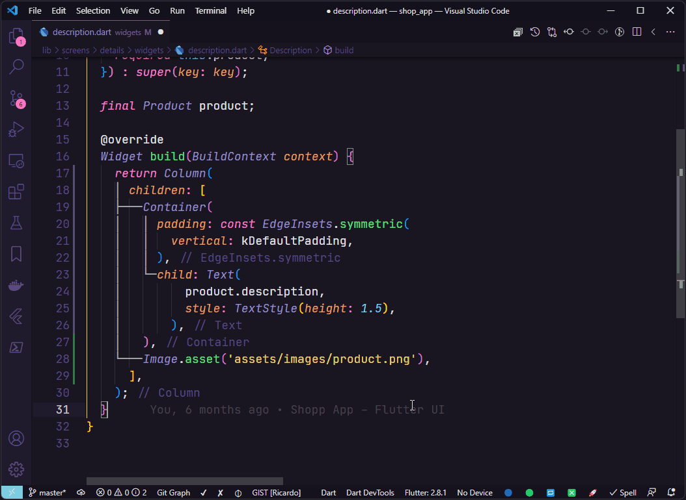
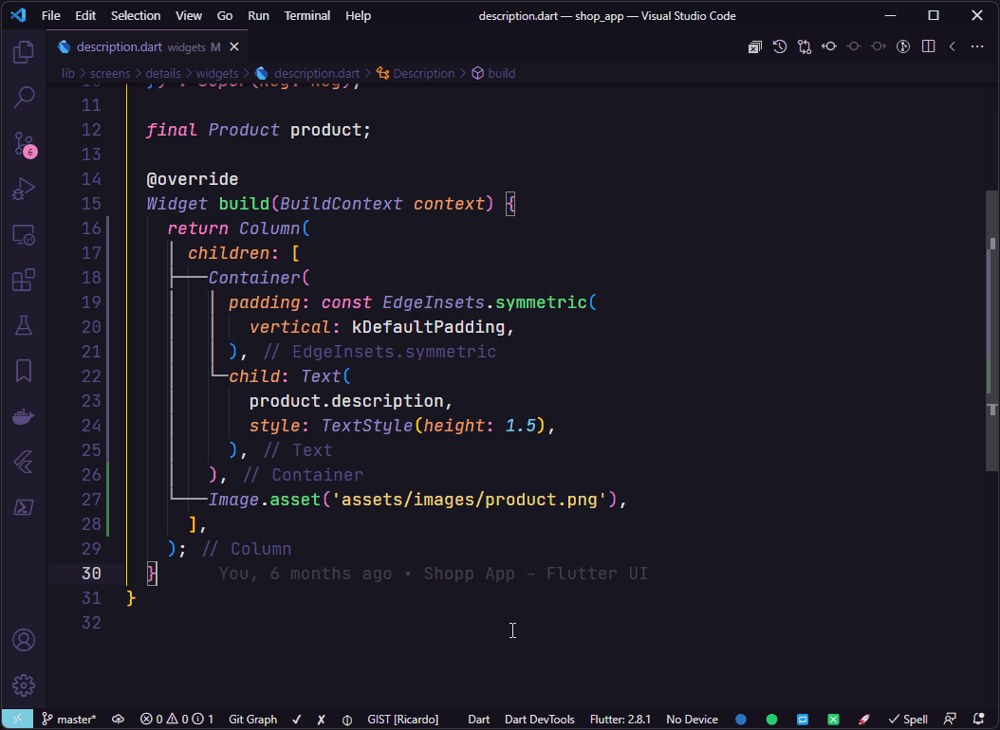
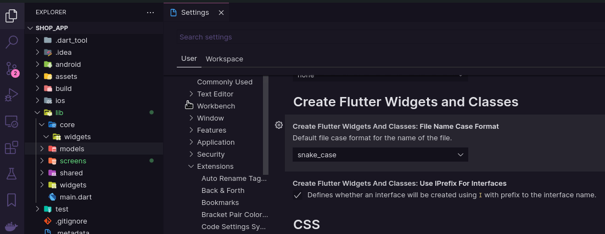

<p align="center">
  <br />
  <a title="Learn more about Create Flutter Widgets and Classes" href="https://github.com/ricardoemerson/create-flutter-widgets-and-classes">
    
    </a>
</p>

## Support

**Create Flutter Widgets and Classes** is an extension created for **Visual Studio Code**. If you find it useful, please consider supporting it.

<table align="center" width="60%" border="0">
  <tr>
    <td>
      <a title="PayPal" href="https://www.paypal.com/donate?hosted_button_id=X26H7L6AVMD96">
        Donate with PayPal
      </a>
    </td>
    <td>
      <a title="Mercado Pago" href="https://mpago.la/1LvP93a">
        Donate with Mercado Pago
      </a>
    </td>
  </tr>
</table>

# Create Flutter Widgets and Classes

[](https://marketplace.visualstudio.com/items?itemName=ricardo-emerson.create-flutter-widgets-and-classes)
[](https://marketplace.visualstudio.com/items?itemName=ricardo-emerson.create-flutter-widgets-and-classes)
[](https://marketplace.visualstudio.com/items?itemName=ricardo-emerson.create-flutter-widgets-and-classes)
[](https://marketplace.visualstudio.com/items?itemName=ricardo-emerson.create-flutter-widgets-and-classes&ssr=false#review-details)

This extension creates Flutter Stateless or Stateful Widgets, MobX Store and Classes.

# Usage Examples

You can create a Flutter Stateless or Stateful Widgets, MobX Store and Classes either by typing in the vscode command palette or by right-clicking any folder in the tree view and use the followed options:

- `📄 Create Dart Class`
- `📦 Create Mobx Store`
- `🔶 Create Flutter Stateless Widget`
- `🔷 Create Flutter Stateful Widget`

### All Commands (Ctrl+Shift+P or Cmd+Shift+P):


### Mouse Right Click:


## Create Flutter Stateless Widget Example:

Select the folder when the widget will be created and choose `🔶 Create Flutter Stateless Widget` and enter the name of the widget to be created.


## Create Flutter Stateful Widget Example:

Select the folder when the widget will be created and choose `🔷 Create Flutter Stateful Widget` and enter the name of the widget to be created.


## Create Dart Class Example:

Select the folder when the class will be created and choose `📄 Create Dart Class` and enter the name of the class to be created.


## Create Mobx Store Example:

Select the folder when the store will be created and choose `📦 Create Mobx Store` and enter the name of the store to be created.


## Wrap with Observer

Use the code actions of Visual Studio Code to wrap a widget that uses an observable property with the widget `Observer` from lib `flutter_mobx`.



## Extra wrappers

### Wrap with Stack


### Wrap with Expanded


### Wrap with Positioned


### Wrap with Form



### Wrap with SafeArea


### Wrap with GestureDetector


## Settings

It is possible choose the case format for the name of widgets and classes.


## File Name Case Format

By default widgets and classes files are created using the `snake_case` format for naming files. It is also possible use the formats: `PascalCase`, `camelCase` and `kebab-case`.



Example of `settings.json`:

```json
{
  "createFlutterWidgetsAndClasses.fileNameCaseFormat": "snake_case|PascalCase|camelCase|kebab-case"
}
```

**Enjoy!**
