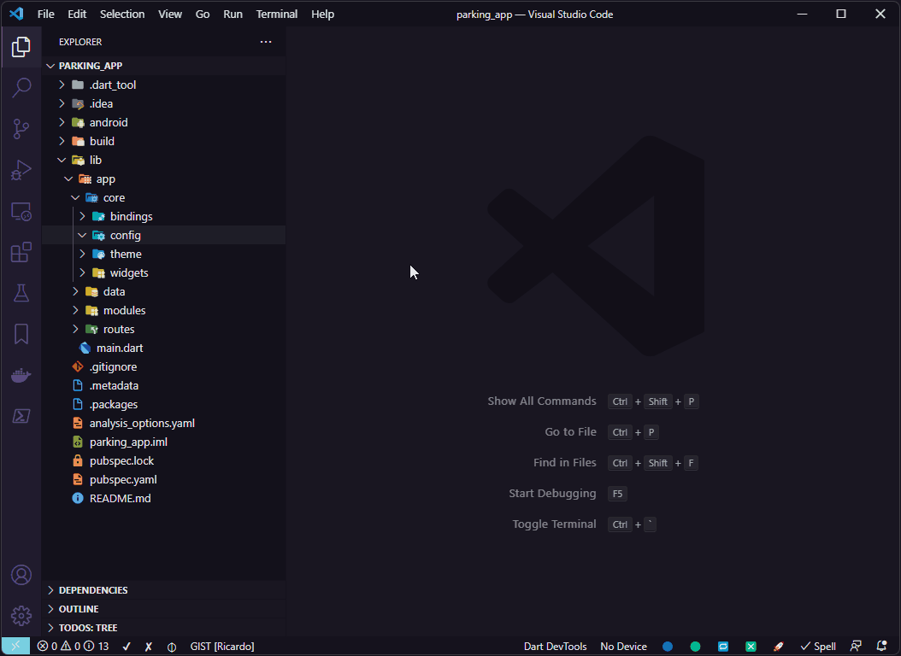
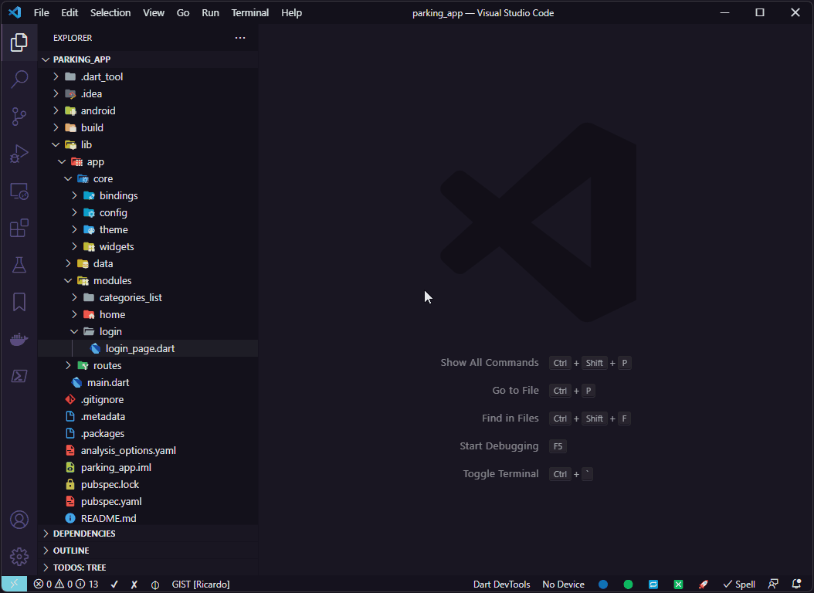
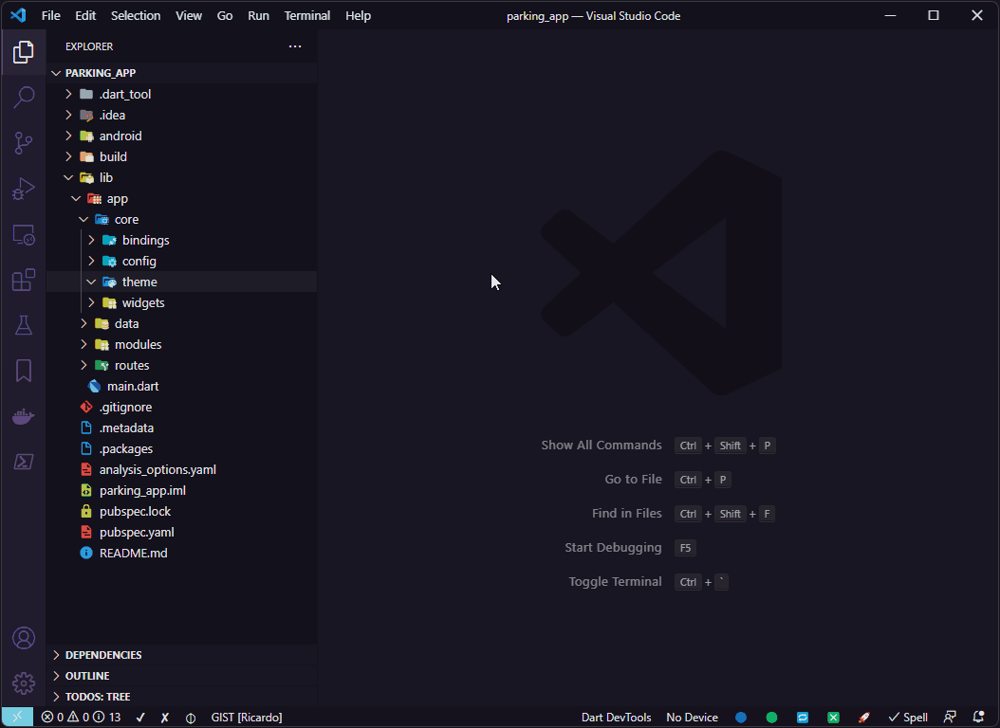
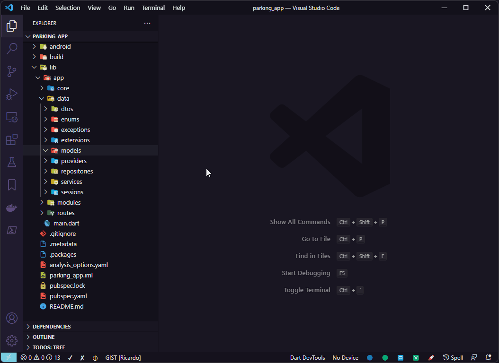
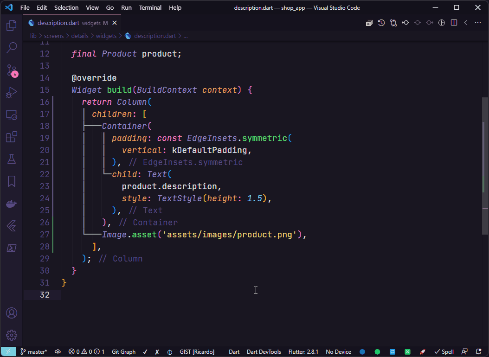
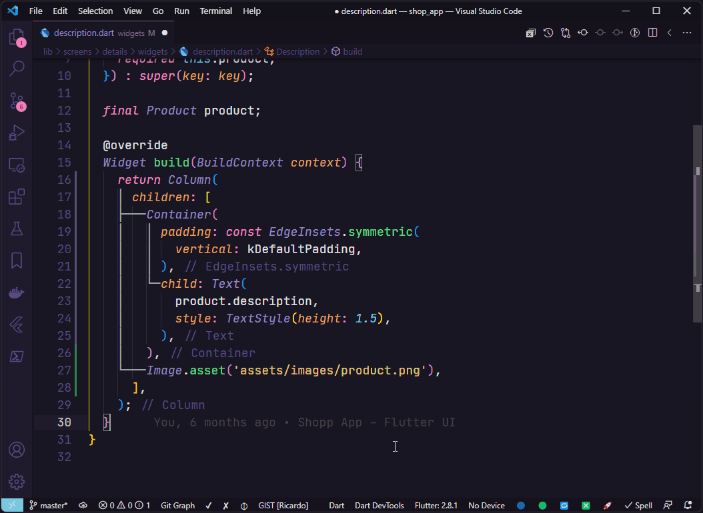
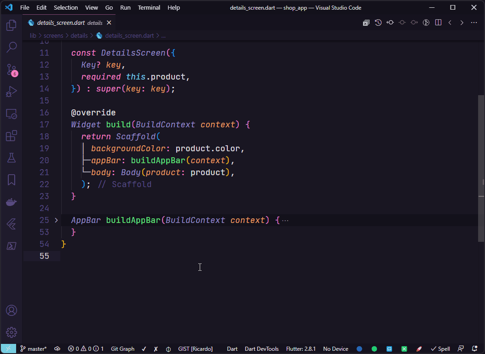
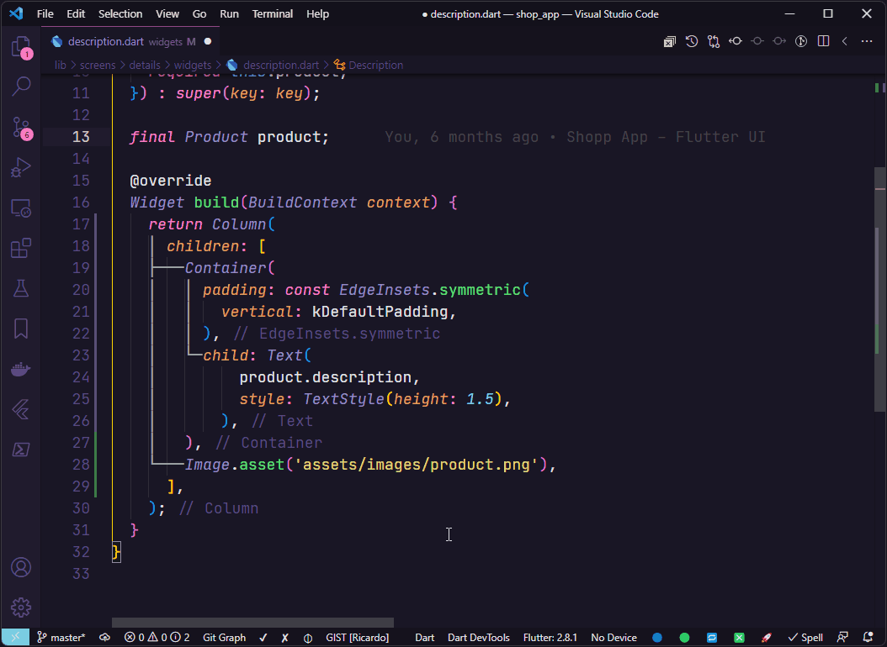

   
  

# What's new in Flutter Tools 2.5.0

- Cleaned up the context menu, removing the items below and added new options via VSCode QuickPick:
  - `Create Controller`
  - `Create DTO`
  - `Create Provider Interface`
  - `Create Repository Interface`
  - `Create Service Interface`
  - `Create Model`
  - `Create Singleton Class`
- Now when choose `Create Stateless Widget` or `Create Stateful Widget` it's possible to choose if a widget will be created as `Component` or `Page`.
- Now when choose `Create MobX Store` it's possible to choose if the suffix name of MobX Store will be created as `Controller` or `Store`.
- Now when choose `Create Class` it's possible to choose the options bellow:
  - `Create Class`
  - `Create Controller Class`
  - `Create Controller Class with ChangeNotifier`
  - `Create DTO Class`
  - `Create Enum`
  - `Create Exception Class`
  - `Create Extension`
  - `Create Helper Class`
  - `Create Interface Class`
  - `Create Mixin`
  - `Create Model Class`
  - `Create Singleton Class`
- Now when choose `Create Interface` it's possible to choose the options bellow:
  - `Create Interface Class`
  - `Create Provider Interface`
  - `Create Repository Interface`
  - `Create Service Interface`
- Added the wrapper `Wrap with ValueListenableBuilder`.
- Added the wrapper `Wrap with InkWell`.
- Updated the template of the wrapper `Wrap with LayoutBuilder`.
- Added configuration of Widgets Page file suffix.
- Added configuration of Create Folder for Widgets Page.
- Removed configuration of MobX file suffix.

# What's new in Flutter Tools 2.4.1

- Changed the template file for Stateful Widgets to avoid this warning `Avoid using private types in public APIs`.

# What's new in Flutter Tools 2.4.0

- Added the context menu item `Create Singleton Class`.

# What's new in Flutter Tools 2.3.1

- For the resource's routes file, a static const variable has been added with the path of the route to represent it, such as `static const home = '/home';` . With this, it is now possible to navigate to a route, for example using `Get.toNamed(HomeRoutes.home);`.
- Added key into Widgets constructors.

# Support

**Flutter Tools** is an extension created for **Visual Studio Code** to be used in your Flutter projects.

> ## This extension has a lot of features, please consider donating so I can continue to add new features.

<table align="center" width="100%" border="0">
  <tr>
    <td >
      
    </td>
    <td>
      
    </td>
  </tr>
</table>

# Flutter Tools

This extension creates Stateless Widgets, Stateful Widgets, GetX App Structure, GetX Features, GetX Services, MobX Store, Classes, Interfaces, and you can also apply to existing widgets the following wrappers in your Flutter projects:

- `Wrap with LayoutBuilder`
- `Wrap with Expanded`
- `Wrap with Stack`
- `Wrap with Positioned`
- `Wrap with Align`
- `Wrap with ClipRRect`
- `Wrap with Hero`
- `Wrap with GestureDetector`
- `Wrap with SingleChildScrollView`
- `Wrap with SafeArea`
- `Wrap with Form`
- `Wrap with Obx`
- `Wrap with Observer`

# Usage Examples

> All the examples shown below were performed using the extension's default settings. In your project feel free to customize as you wish.

You can create Stateless Widgets, Stateful Widgets, GetX App Structures, GetX Features, GetX Services, MobX Store, Classes and Interfaces by right clicking on any folder in the tree view and using the following options:

# Widgets

## Create Stateless Widget Example:

To create a Stateless Widget, right-click on the folder where the widget will be created, choose `🔶 Create Stateless Widget` and inform the name of the widget that will be created.

## Create Stateful Widget Example:

To create a Stateful Widget, right-click on the folder where the widget will be created, choose `🔷 Create Stateful Widget` and inform the name of the widget that will be created.

# GetX

## Create GetX App Structure Example:

> You need to have the `get` package installed in your `pubspec.yaml`

To create a GetX App Structure, right-click on the `lib` folder and choose `📂 Create GetX App Structure`.

The folders that will be created by the command `📂 Create GetX App Structure`:

If you not will use some folder, just delete it from your project.

## Create GetX Feature Example:

> You need to have the `get` package installed in your `pubspec.yaml`

To create a GetX resource that is composed of the `view`, `controller`, `binding` and `route` files, right-click on the `modules` folder or any subfolder inside it and choose `📑 Create GetX Feature`.

You can create a folder to group GetX resources. In this case the name of the route file will be the name of the folder created, as we can see in the example below:

## Create GetX Service Example:

> You need to have the `get` package installed in your `pubspec.yaml`

To create a GetX Service, right-click on the desired folder and choose  `🗃️ Create GetX Service`.

# MobX

## Create MobX Store

> You need to have the `mobx and flutter_mobx` package installed in your `pubspec.yaml`

To create a MobX Store, right-click on the desired folder and choose `📦 Create MobX Store`.

# Interface for Providers, Repositories and Services

## Create Provider Interface Example:

Select the folder where the Provider Interface will be created and choose `📄 Create Provider Interface` and enter the name of the provider interface to be created.

## Create Repository Interface Example:

Select the folder where the Repository Interface will be created and choose `📄 Create Repository Interface` and enter the name of the repository interface to be created.

## Create Service Interface Example:

Select the folder where the Service Interface will be created and choose `📄 Create Service Interface` and enter the name of the service interface to be created.

# Classes

## Create Class Example:

Select the folder where the class will be created and choose `📝 Create Dart Class` and enter the name of the class to be created.

## Create Controller Example:

Select the folder where the controller will be created and choose `📝 Create Controller` and enter the name of the controller to be created.

## Create DTO Example:

Select the folder where the DTO will be created and choose `📝 Create DTO` and enter the name of the DTO to be created.

## Create Interface Example:

Select the folder where the interface will be created and choose `📝 Create Interface` and enter the name of the interface to be created.

## Create Model Example:

Select the folder where the model will be created and choose `📝 Create Model` and enter the name of the model to be created.

## Create Singleton Class Example:

Select the folder where the model will be created and choose `📝 Create Singleton Class` and enter the name of the singleton class to be created.

# Code Actions

## Code action Implements Interface:

In interfaces files it is possible to use the code action `Implements interface` to create interface implementation file case it is not implemented yet or when already exists and you want create another implementation of interface.

# Extra wrappers

Use the code actions of Visual Studio Code to wrap a widget with one of the following wrappers:

- `Wrap with LayoutBuilder`
- `Wrap with Expanded`
- `Wrap with Stack`
- `Wrap with Positioned`
- `Wrap with Align`
- `Wrap with ClipRRect`
- `Wrap with Hero`
- `Wrap with GestureDetector`
- `Wrap with SingleChildScrollView`
- `Wrap with SafeArea`
- `Wrap with Form`
- `Wrap with Obx`
- `Wrap with Observer`

## Wrap with LayoutBuilder

## Wrap with Expanded

## Wrap with Stack

## Wrap with Positioned

## Wrap with Align

## Wrap with ClipRRect

## Wrap with Hero

## Wrap with GestureDetector

## Wrap with SingleChildScrollView

## Wrap with SafeArea

## Wrap with Form

## Wrap with Obx

In case of use of `GetX`, it is possible to wrapper a widget that uses an observable property with the widget `Obx` from lib [`get`](https://pub.dev/packages/get).

## Wrap with Observer

In case of use of `MobX`, it is possible to wrapper a widget that uses an observable property with the widget `Observer` from lib [`flutter_mobx`](https://pub.dev/packages/flutter_mobx).

## If wrap fails and breaks the code?

In some widgets structures by positioning the cursor over the widget which will be surrounded by new widget may cause breaking the code.

In this case, undo the last operation and select all the widget that will be wrapped using the shorcut `Alt` + `W`, then use Visual Studio Code `code actions` and choose the appropriate wrapper.

# Settings

The **Flutter Tools** has many settings that change it's behavior when creating Interfaces, GetX Features and MobX Store.

> The previous name of extension was **Create Widgets and Classes for Flutter** and now the name it's **Flutter Tools**. So in your VSCode the name of extension in settings will be the new name.

## Create Folder for Interfaces

Defines if it will create a folder to contain the **interface** and **implementation** only for `Providers`, `Repositories` and `Services`.

## Create Implementation of Interface

Defines whether the implementation class of an interface will be created together.

## GetX Display Context Menu

Defines if the context menu with GetX features will be displayed.

## GetX Project Path

Default path for the GetX Project folders and files.

## GetX Use Constructor Tear-offs

Defines if the Bindings and Routes files will use the new Dart language feature named Constructor tear-offs.

## GetX View Suffix

Default suffix name for the GetX view layer.

## MobX Display Context Menu

Defines if the context menu with MobX features will be displayed.

## MobX File Suffix

Default suffix name for the MobX store.

## Use `I` Prefix For Interfaces

Defines whether an interface will be created using `I` with prefix to the interface name..

**That's all, Enjoy!**
