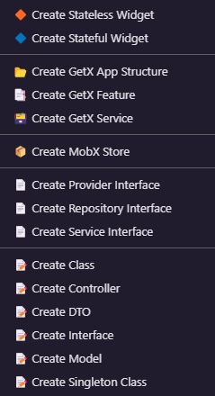
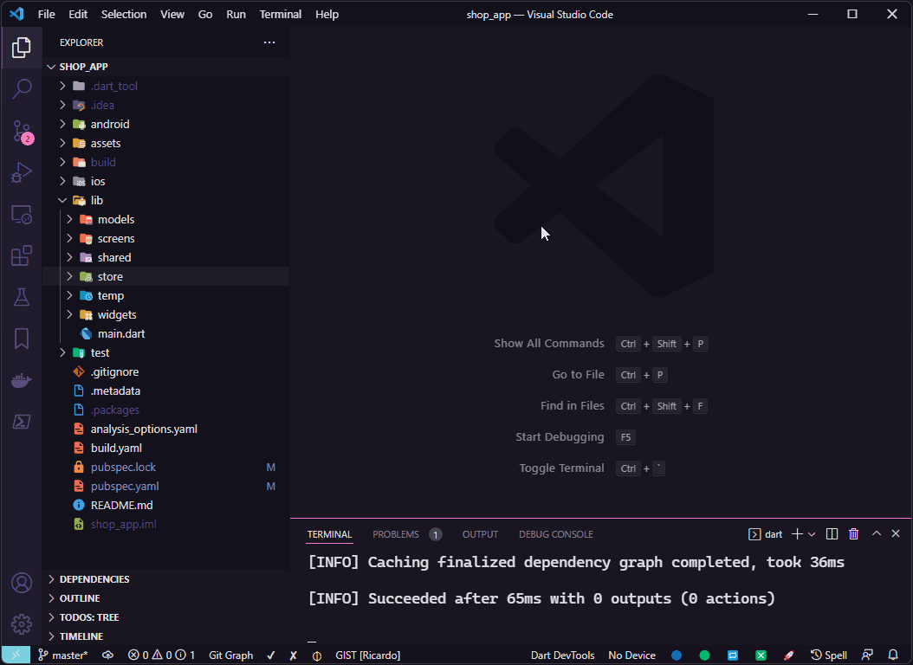
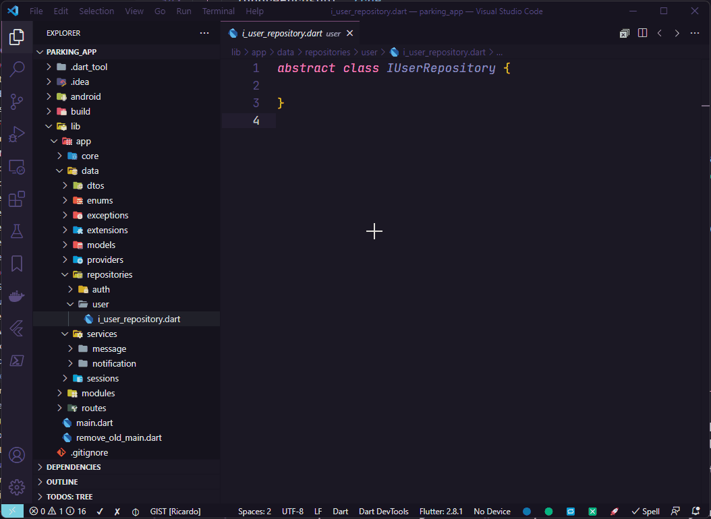
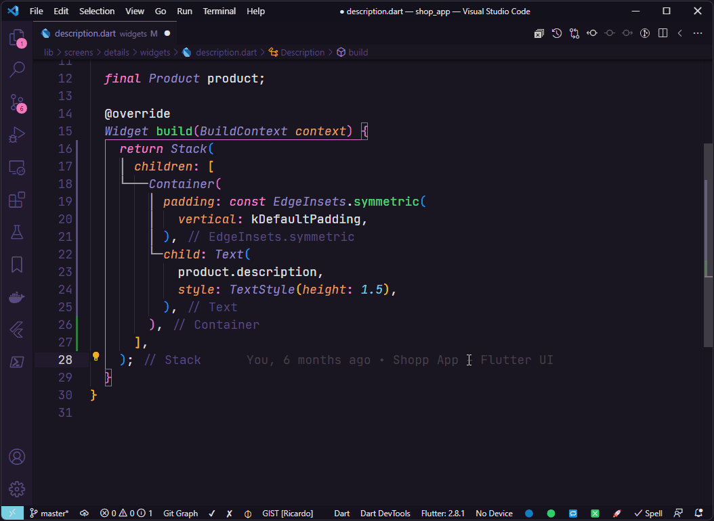

   
  

# What's new in Flutter Tools 3.0 🎉

- Cleaned up the context menu, removing the items below and added new options via VSCode QuickPick:
  - `📝 Create Controller`
  - `📝 Create DTO`
  - `📄 Create Provider Interface`
  - `📄 Create Repository Interface`
  - `📄 Create Service Interface`
  - `📝 Create Model`
  - `📝 Create Singleton Class`
- Now when choose `Create Stateless Widget` or `Create Stateful Widget` it's possible to choose if a widget will be created as `🧩 Component` or `📑 Page`.
- Now when choose `Create MobX Store` it's possible to choose if the suffix name of MobX Store will be created as `🗂️ Controller` or `📦 Store`.
- Now when choose `Create Class` it's possible to choose the options below:
  - `📝 Create Class`
  - `📝 Create Controller Class`
  - `📝 Create Controller Class with ChangeNotifier`
  - `📝 Create DTO Class`
  - `📃 Create Enum`
  - `⛔ Create Exception Class`
  - `📇 Create Extension`
  - `📝 Create Helper Class`
  - `📄 Create Interface Class`
  - `📒 Create Mixin`
  - `📝 Create Model Class`
  - `📝 Create Singleton Class`
- Now when choose `Create Interface` it's possible to choose the options below:
  - `📄 Create Interface Class`
  - `📄 Create Provider Interface`
  - `📄 Create Repository Interface`
  - `📄 Create Service Interface`
- Added the wrapper `Wrap with ValueListenableBuilder`.
- Added the wrapper `Wrap with InkWell`.
- Updated the template of the wrapper `Wrap with LayoutBuilder`.
- Added configuration of Widgets Page file suffix.
- Added configuration of Create Folder for Widgets Page.
- Removed configuration of MobX file suffix.
- Cleaned up the wrappers widgets context menu, removing the items below and added new options via VSCode QuickPick:
  - `Wrap with Align`
  - `Wrap with ClipRRect`
  - `Wrap with ConstrainedBox`
  - `Wrap with Expanded`
  - `Wrap with Flexible`
  - `Wrap with Form`
  - `Wrap with GestureDetector`
  - `Wrap with Hero`
  - `Wrap with InkWell`
  - `Wrap with IntrinsicHeight`
  - `Wrap with IntrinsicWidth`
  - `Wrap with LayoutBuilder`
  - `Wrap with LayoutBuilder and SingleChildScrollView`
  - `Wrap with Observer for MobX`
  - `Wrap with Obx for GetX`
  - `Wrap with Positioned`
  - `Wrap with SafeArea`
  - `Wrap with SingleChildScrollView`
  - `Wrap with Stack`
  - `Wrap with ValueListenableBuilder`
  - `Wrap with Visibility`

- Added a check if some GetX folders exist to avoid errors.
- Added [175 snippets](#snippets) that can be accessed with `ft-` prefix.
- Added the list of available snippets inside the README.md file in the [Snippets](#snippets) section.
- Adds notification message for extension updates.

# What's new in Flutter Tools 2.4.1

- Changed the template file for Stateful Widgets to avoid this warning `Avoid using private types in public APIs`.

# What's new in Flutter Tools 2.4.0

- Added the context menu item `Create Singleton Class`.

# What's new in Flutter Tools 2.3.1

- For the resource's routes file, a static const variable has been added with the path of the route to represent it, such as `static const home = '/home';` . With this, it is now possible to navigate to a route, for example using `Get.toNamed(HomeRoutes.home);`.
- Added key into Widgets constructors.

# Support

**Flutter Tools** is an extension created for **Visual Studio Code** to be used in your Flutter projects.

> ## This extension has a lot of features, please consider donating so I can continue to add new features.

<table align="center" width="100%" border="0">
  <tr>
    <td >
      
    </td>
    <td>
      
    </td>
  </tr>
</table>

# Flutter Tools (Documentation of version 2.4.1)

This extension creates Stateless Widgets, Stateful Widgets, GetX App Structure, GetX Features, GetX Services, MobX Store, Classes, Interfaces, and you can also apply to existing widgets the following wrappers in your Flutter projects:

- `Wrap with Align`
- `Wrap with ClipRRect`
- `Wrap with ConstrainedBox`
- `Wrap with Expanded`
- `Wrap with Flexible`
- `Wrap with Form`
- `Wrap with GestureDetector`
- `Wrap with Hero`
- `Wrap with InkWell`
- `Wrap with IntrinsicHeight`
- `Wrap with IntrinsicWidth`
- `Wrap with LayoutBuilder`
- `Wrap with LayoutBuilder and SingleChildScrollView`
- `Wrap with Positioned`
- `Wrap with SafeArea`
- `Wrap with SingleChildScrollView`
- `Wrap with Stack`
- `Wrap with ValueListenableBuilder`
- `Wrap with MobX Observer`
- `Wrap with GetX Obx`

# Usage Examples

> All the examples shown below were performed using the extension's default settings. In your project feel free to customize as you wish.

You can create Stateless Widgets, Stateful Widgets, GetX App Structures, GetX Features, GetX Services, MobX Store, Classes and Interfaces by right clicking on any folder in the tree view and using the following options:

# Widgets

## Create Stateless Widget Example:

To create a Stateless Widget, right-click on the folder where the widget will be created, choose `🔶 Create Stateless Widget` and inform the name of the widget that will be created.

## Create Stateful Widget Example:

To create a Stateful Widget, right-click on the folder where the widget will be created, choose `🔷 Create Stateful Widget` and inform the name of the widget that will be created.

# GetX

## Create GetX App Structure Example:

> You need to have the `get` package installed in your `pubspec.yaml`

To create a GetX App Structure, right-click on the `lib` folder and choose `📂 Create GetX App Structure`.

The folders that will be created by the command `📂 Create GetX App Structure`:

If you not will use some folder, just delete it from your project.

## Create GetX Feature Example:

> You need to have the `get` package installed in your `pubspec.yaml`

To create a GetX resource that is composed of the `view`, `controller`, `binding` and `route` files, right-click on the `modules` folder or any subfolder inside it and choose `📑 Create GetX Feature`.

You can create a folder to group GetX resources. In this case the name of the route file will be the name of the folder created, as we can see in the example below:

## Create GetX Service Example:

> You need to have the `get` package installed in your `pubspec.yaml`

To create a GetX Service, right-click on the desired folder and choose  `🗃️ Create GetX Service`.

# MobX

## Create MobX Store

> You need to have the `mobx and flutter_mobx` package installed in your `pubspec.yaml`

To create a MobX Store, right-click on the desired folder and choose `📦 Create MobX Store`.

# Interface for Providers, Repositories and Services

## Create Provider Interface Example:

Select the folder where the Provider Interface will be created and choose `📄 Create Provider Interface` and enter the name of the provider interface to be created.

## Create Repository Interface Example:

Select the folder where the Repository Interface will be created and choose `📄 Create Repository Interface` and enter the name of the repository interface to be created.

## Create Service Interface Example:

Select the folder where the Service Interface will be created and choose `📄 Create Service Interface` and enter the name of the service interface to be created.

# Classes

## Create Class Example:

Select the folder where the class will be created and choose `📝 Create Dart Class` and enter the name of the class to be created.

## Create Controller Example:

Select the folder where the controller will be created and choose `📝 Create Controller` and enter the name of the controller to be created.

## Create DTO Example:

Select the folder where the DTO will be created and choose `📝 Create DTO` and enter the name of the DTO to be created.

## Create Interface Example:

Select the folder where the interface will be created and choose `📝 Create Interface` and enter the name of the interface to be created.

## Create Model Example:

Select the folder where the model will be created and choose `📝 Create Model` and enter the name of the model to be created.

## Create Singleton Class Example:

Select the folder where the model will be created and choose `📝 Create Singleton Class` and enter the name of the singleton class to be created.

# Code Actions

## Code action Implements Interface:

In interfaces files it is possible to use the code action `Implements interface` to create interface implementation file case it is not implemented yet or when already exists and you want create another implementation of interface.

# Extra wrappers

Use the code actions of Visual Studio Code to wrap a widget with one of the following wrappers:

- `Wrap with LayoutBuilder`
- `Wrap with Expanded`
- `Wrap with Stack`
- `Wrap with Positioned`
- `Wrap with Align`
- `Wrap with ClipRRect`
- `Wrap with Hero`
- `Wrap with GestureDetector`
- `Wrap with SingleChildScrollView`
- `Wrap with SafeArea`
- `Wrap with Form`
- `Wrap with Obx`
- `Wrap with Observer`

## Wrap with LayoutBuilder

## Wrap with Expanded

## Wrap with Stack

## Wrap with Positioned

## Wrap with Align

## Wrap with ClipRRect

## Wrap with Hero

## Wrap with GestureDetector

## Wrap with SingleChildScrollView

## Wrap with SafeArea

## Wrap with Form

## Wrap with Obx

In case of use of `GetX`, it is possible to wrapper a widget that uses an observable property with the widget `Obx` from lib [`get`](https://pub.dev/packages/get).

## Wrap with Observer

In case of use of `MobX`, it is possible to wrapper a widget that uses an observable property with the widget `Observer` from lib [`flutter_mobx`](https://pub.dev/packages/flutter_mobx).

## If wrap fails and breaks the code?

In some widgets structures by positioning the cursor over the widget which will be surrounded by new widget may cause breaking the code.

In this case, undo the last operation and select all the widget that will be wrapped using the shortcut `Alt` + `W`, then use Visual Studio Code `code actions` and choose the appropriate wrapper.

# Snippets

All snippets are available through prefix `ft-`.

## Flutter and Dart

| Snippet | Description |
|---|---|
| `ft-imp-dart-date` | Adds Dart Date import |
| `ft-part` | Adds part file for main file |
| `ft-part-of` | Adds part of main file |
| `ft-get-file-name` | Adds current filename in pascal case |
| `ft-class` | Creates a class for the current file |
| `ft-constructor-class` | Creates a class constructor for the current file |
| `ft-constructor-class-with-named-params` | Creates a class constructor for the current file with named params |
| `ft-private-construtor` | Creates a private class constructor for the current file |
| `ft-private-attribute` | Creates a private class attribute |
| `ft-constr-inject-firebase-auth` | Creates an injection for Firebase Auth - Complete |
| `ft-add-inject-firebase-auth` | Adds an injection for Firebase Auth - Parts to include |
| `ft-constr-inject-controller` | Creates an injection for Controller - Complete |
| `ft-add-inject-controller` | Adds an injection for Controller - Parts to include |
| `ft-constr-inject-i-service` | Creates an injection for IService - Complete |
| `ft-constr-inject-service` | Creates an injection for Service - Complete |
| `ft-add-inject-i-service` | Creates an injection for IService - Parts to include |
| `ft-add-inject-service` | Creates an injection for Service - Parts to include |
| `ft-constr-inject-i-repository` | Creates an injection for IRepository - Complete |
| `ft-constr-inject-repository` | Creates an injection for Repository - Complete |
| `ft-add-inject-i-repository` | Adds an injection for IRepository - Parts to include |
| `ft-add-inject-repository` | Adds an injection for Repository - Parts to include |
| `ft-constr-inject-session` | Creates an injection for Session - Complete |
| `ft-add-inject-session` | Adds an injection for Session - Parts to include |
| `ft-constr-inject-i-provider` | Creates an injection for IProvider - Complete |
| `ft-constr-inject-provider` | Creates an injection for Provider - Complete |
| `ft-add-inject-i-provider` | Adds an injection for IProvider - Parts to include |
| `ft-add-inject-provider` | Adds an injection for Provider - Parts to include |
| `ft-constr-inject-rest-client` | Creates an injection for RestClient - Complete |
| `ft-add-inject-rest-client` | Adds an injection for RestClient - Parts to include |
| `ft-constr-inject-i-api-storage` | Creates an injection for ApiCacheStorageService - Complete |
| `ft-add-inject-i-api-storage` | Adds an injection for ApiCacheStorageService - Parts to include |
| `ft-constr-inject-rest-client-with-i-api-storage` | Creates an injection for RestClient and ApiCacheStorageService - Complete |
| `ft-ifnot` | Creates an if denying the condition |
| `ft-if-return` | Creates an if with return if condition was truthy |
| `ft-ifnot-return` | Creates an if with return if condition was falsy |
| `ft-ifnot-mounted` | Creates an if with return if StateFull Widget it'n mounted |
| `ft-ifnull` | Creates an if for null condition |
| `ft-ifnotnull` | Creates an if for not null condition |
| `ft-ifcontains` | Creates an if for check if String contains term |
| `ft-cm-basic` | Creates a basic comment |
| `ft-cm-block` | Creates a block comment |
| `ft-cm-section` | Creates a section comment |
| `ft-cm-subsection` | Creates a subsection comment |
| `ft-cm-section-footer` | Creates a footer comment |
| `ft-cm-element-block` | Creates a documentation comment |
| `ft-delayed-seconds` | Adds a Future.delayed instruction |
| `ft-delayed-seconds-with-callback` | Adds a Future.delayed instruction with a callback function |
| `ft-duration` | Adds a Duration instruction |
| `ft-final-void-function` | Adds property as a void Function() |
| `ft-final-void-call-back` | Adds property as a VoidCallback function |
| `ft-form-key` | Adds a variable of type GlobalKey<FormState>() |
| `ft-form-key-private` | Adds a private variable of type GlobalKey<FormState>() |
| `ft-focus-node` | Adds a variable of type FocusNode() |
| `ft-focus-node-private` | Adds a private variable of type FocusNode() |
| `ft-text-editing-controller`, `ft-editing-controller` | Adds a variable of type TextEditingController() |
| `ft-text-editing-controller-private`, `ft-editing-controller-private` | Adds a private variable of type TextEditingController() |
| `ft-list-from-map-and-json` | Adds two functions fromMap and fromJson to create lists from map data |
| `ft-prop-eq` | Adds a key and value assignment to an object where the key and value are equal |
| `ft-prop-eq-map` | Adds a key and value assignment to an map where the key and value are equal |
| `ft-throw-exception` | Adds the instruction throw Exception() |
| `ft-throw-app-exception` | Adds the instruction throw AppException() |
| `ft-throw-auth-exception` | Adds the instruction throw AuthException() |
| `ft-await` | Adds the instruction await |
| `ft-final-simple` | Adds a simple assignment variable |
| `ft-final-await` | Adds a future assignment variable |
| `ft-final-future-wait` | Adds a future assignment variable for multiple futures processing |
| `ft-build-context` | Adds a declaration for BuildContext |
| `ft-date-format-dd-mm-yyyy` | Adds a variable of type DateFormat('dd/MM/y') |
| `ft-future-method` | Adds a Future method |
| `ft-future-void-method` | Adds a Future void method |
| `ft-void-method` | Adds a void method |
| `ft-form-is-valid` | Check if a form is valid |
| `ft-get-property` | Adds a get property |
| `ft-static-get-property` | Adds a static get property |
| `ft-signature-static-method` | Add a signature to a static method |
| `ft-signature-method` | Add a signature to method |
| `ft-static-method` | Adds a static method |
| `ft-signature-future-static-method` | Adds a signature of a future static method |
| `ft-signature-future-method` | Adds a signature of a future method |
| `ft-future-static-method` | Adds a future static method |
| `ft-value-notifier` | Creates a ValueNotifier attribute |

## Widgets

| Snippet | Description |
|---|---|
| `ft-border-side` | Adds borderSide property using BorderSide() with width and color |
| `ft-border-side-color` | Adds borderSide property using BorderSide() with color |
| `ft-shape-rounded-rectangle-border` | Adds a shape property using RoundedRectangleBorder() |
| `ft-main-axis-size` | Adds mainAxisSize property using MainAxisSize to Row() or Column() |
| `ft-main-axis-alignment` | Adds mainAxisAlignment property using MainAxisAlignment to Row() or Column() |
| `ft-cross-axis-alignment` | Adds crossAxisAlignment property using CrossAxisAlignment to Row() or Column() |
| `ft-alignment` | Adds alignment property using Alignment |
| `ft-wrap-alignment` | Adds alignment property using WrapAlignment |
| `ft-font-weight` | Adds FontWeight |
| `ft-text-align` | Adds TextAlign |
| `ft-0xff`, `ft-hex-color` | Adds a Hexadecimal Color |
| `ft-color-hex` | Adds a color property using a Hexadecimal Color |
| `ft-color` | Adds a color property using Colors |
| `ft-background-color` | Adds a backgroundColor property using Colors |
| `ft-background-color-hex` | Adds a backgroundColor property using a Hexadecimal Color |
| `ft-color-theme` | Adds a color property using Theme.of(context) |
| `ft-theme-of` | Adds a color using Theme.of(context) |
| `ft-text-overflow` | Adds an overflow property using TextOverflow.ellipsis |
| `ft-space-vertical`, `ft-separator-vertical` | Adds a vertical spacing between widgets using SizedBox |
| `ft-space-horizontal`, `ft-separator-horizontal` | Adds a horizontal spacing between widgets using SizedBox |
| `ft-space-shrink` | Adds a SizedBox.shrink() |
| `ft-margin-all` | Adds margin property using EdgeInsets.all() |
| `ft-margin-symmetric` | Adds margin property using EdgeInsets.symmetric() |
| `ft-margin-only` | Adds margin property using EdgeInsets.only() |
| `ft-padding-all` | Adds padding property using EdgeInsets.all() |
| `ft-padding-symmetric` | Adds padding property using EdgeInsets.symmetric() |
| `ft-padding-only` | Adds padding property using EdgeInsets.only() |
| `ft-padding-zero` | Adds padding property using EdgeInsets.zero |
| `ft-edge-insets-zero` | Adds EdgeInsets.zero |
| `ft-border-all` | Adds border property using Border.all() |
| `ft-border-symmetric` | Adds border property using Border.symmetric() |
| `ft-bouncing-scroll-physics` | Adds physics property using BouncingScrollPhysics() |
| `ft-direction` | Adds direction property using Axis |
| `ft-scroll-direction` | Adds scrollDirection property using Axis |
| `ft-navigator-push-named` | Adds Navigator instruction using pushNamed |
| `ft-navigator-pop` | Adds Navigator instruction using pop |
| `ft-navigator-push` | Adds Navigator instruction using MaterialPageRoute |
| `ft-media-query` | Adds MediaQuery instruction using size |
| `ft-app-bar-theme` | Adds appBarTheme property using AppBarTheme() |
| `ft-app-bar-brightness` | Adds brightness property using Brightness |
| `ft-text-style` | Adds style property using TextStyle() with color, fontSize and fontWeight |
| `ft-text-style-weight` | Adds style property using TextStyle() only for fontWeight |
| `ft-text-style-size` | Adds style property using TextStyle() only for fontSize |
| `ft-text-style-color` | Adds style property using TextStyle() only for color |
| `ft-text-style-theme-of` | Adds style property using Theme.of(context).textTheme |
| `ft-image-asset` | Adds Image Widget with properties height, width, image and fit |
| `ft-fit-box-fit` | Adds fit property using BoxFit |
| `ft-icon-button` | Adds IconButton Widget with properties icon, color, iconSize and onPressed |
| `ft-elevated-rectangle-button` | Adds ElevatedButton Widget using BorderRadius() |
| `ft-elevated-circ-button` | Adds ElevatedButton Widget using CircleBorder() |
| `ft-decoration` | Adds decoration property using BoxDecoration |
| `ft-decoration-with-decoration-image` | Adds decoration property using BoxDecoration and DecorationImage |
| `ft-decoration-image` | Adds image property using DecorationImage |
| `ft-decoration-with-border-radius` | Adds decoration property using BoxDecoration with BorderRadius.circular() |
| `ft-border-radius` | Adds borderRadius property using BorderRadius.circular() |
| `ft-decoration-with-border-radius-only` | Adds decoration property using BoxDecoration with BorderRadius.only() |
| `ft-border-radius-only` | Adds borderRadius property using BorderRadius.only() |
| `ft-decoration-with-box-shadow` | Adds decoration property using BoxDecoration with BoxShadow |
| `ft-box-shadow` | Adds boxShadow property using BoxShadow |
| `ft-decoration-with-box-shadow-bottom-sheet` | Adds decoration property using BoxDecoration with BoxShadow for Bottom Sheet |
| `ft-box-shadow-bottom-sheet` | Adds boxShadow property using BoxShadow for Bottom Sheet |
| `ft-column` | Adds Column Widget |
| `ft-row` | Adds Row Widget |
| `ft-text` | Adds Text Widget |
| `ft-text-span` | Adds TextSpan Widget with text property |
| `ft-text-span-children` | Adds TextSpan Widget with children property |
| `ft-outlined-icon-button` | Adds OutlinedButton Widget with Icon |
| `ft-status-bar-icon-brightness` | Sets the color for statusBarIconBrightness |
| `ft-text-input-action`, `ft-input-action` | Adds textInputAction property using TextInputAction |
| `ft-text-capitalization` | Adds textCapitalization property using TextCapitalization |
| `ft-keyboard-type`, `ft-input-type` | Adds keyboardType property using TextInputType |
| `ft-ensure-initialized` | Adds the instruction WidgetsFlutterBinding.ensureInitialized(); |
| `ft-scaffold` | Adds Scaffold Widget |
| `ft-popup-menu-button` | Adds PopupMenuButton Widget |
| `ft-constraints-box-constraints` | Adds constraints property using BoxConstraints |
| `ft-add-locales-pt-br` | Adds localizations for pt-BR |
| `ft-text-shadow` | Adds shadows property using Shadow to use in Text Widget |
| `ft-text-rich` | Adds Text.rich Widget |

## GetX

| Snippet | Description |
|---|---|
| `ft-imp-get` | Adds GetX import |
| `ft-rx-attribute` | Creates a Rx attribute |
| `ft-rxn-attribute` | Creates a Rxn attribute |
| `ft-obs-attribute` | Creates a GetX Observable attribute |
| `ft-get-size` | Uses GetX to get width or height of screen |
| `ft-get-find` | Adds the Get.find() the get instance of classe using GetX |
| `ft-get-width` | Uses GetX to get width of screen |
| `ft-get-height` | Uses GetX to get height of screen |
| `ft-width-get-width` | Adds width property using Get.width |
| `ft-height-get-height` | Adds width property using Get.height |
| `ft-get-put-service` | Adds Get.put() instruction for Service() |
| `ft-get-put-service-impl` | Adds Get.put() instruction for ServiceImpl() |
| `ft-get-put-session` | Adds Get.put() instruction for Session() |
| `ft-get-put-repository` | Adds Get.put() instruction for Repository() |
| `ft-get-put-repository-impl` | Adds Get.put() instruction for RepositoryImpl() |
| `ft-get-put-provider` | Adds Get.put() instruction for Provider() |
| `ft-get-put-provider-impl` | Adds Get.put() instruction for ProviderImpl() |
| `ft-get-view` | Adds GetView instruction for get instance of controller inside view |
| `ft-get-put-controller` | Adds Get.put() instruction for Controller() |
| `ft-get-lazy-put-controller` | Adds Get.lazyPut() instruction for Controller() |
| `ft-get-lazy-put-provider` | Adds Get.lazyPut() instruction for Provider() used by a Service() |
| `ft-get-lazy-put-provider` | Adds Get.lazyPut() instruction for ProviderImpl() used by a ServiceImpl() |
| `ft-get-lazy-put-service` | Adds Get.lazyPut() instruction for Service() |
| `ft-get-lazy-put-service-impl` | Adds Get.lazyPut() instruction for ServiceImpl() |
| `ft-get-lazy-put-repository` | Adds Get.lazyPut() instruction for Repository() used by a Service() |
| `ft-get-lazy-put-repository` | Adds Get.lazyPut() instruction for RepositoryImpl() used by a ServiceImpl() |
| `ft-on-init` | Adds override for onInit method |
| `ft-on-ready` | Adds override for onReady method |
| `ft-on-close` | Adds override for onClose method |

## Provider

| Snippet | Description |
|---|---|
| `ft-provider-read` | Adds the context.read() to get instance of classe using Provider |
| `ft-provider-read-data` | Adds the context.read<type>()... to get instance of classe using Provider |
| `ft-provider-watch` | Adds the context.watch<type>()... to watch instance of classe using Provider |
| `ft-provider-select` | Adds the context.select<ClassName, type>()... to select instance of classe using Provider |

## Modular

| Snippet | Description |
|---|---|
| `ft-modular-module` | Creates a Flutter Modular Module |
| `ft-modular-get` | Adds the Modular.get() the get instance of class using Modular |
| `ft-modular-get-of-type` | Adds the Modular.get<Class>() to get instance of class using Modular |
| `ft-bind-lazy-singleton-i-class` | Adds Bind.lazySingleton() instruction for any IClass using Modular |
| `ft-bind-lazy-singleton-class` | Adds Bind.lazySingleton() instruction for any Class using Modular |
| `ft-bind-lazy-singleton-controller` | Adds Bind.lazySingleton() instruction for Controller using Modular |
| `ft-bind-lazy-singleton-repository` | Adds Bind.lazySingleton() instruction for Repository() used by a Service() using Modular |
| `ft-bind-lazy-singleton-repository-impl` | Adds Bind.lazySingleton() instruction for RepositoryImpl() used by a ServiceImpl() using Modular |
| `ft-bind-lazy-singleton-service` | Adds Bind.lazySingleton() instruction for Service() using Modular |
| `ft-bind-lazy-singleton-service-impl` | Adds Bind.lazySingleton() instruction for ServiceImpl() using Modular |

# Settings

The **Flutter Tools** has many settings that change it's behavior when creating Interfaces, GetX Features and MobX Store.

> The previous name of extension was **Create Widgets and Classes for Flutter** and now the name it's **Flutter Tools**. So in your VSCode the name of extension in settings will be the new name.

## Create Folder for Interfaces

Defines if it will create a folder to contain the **interface** and **implementation** only for `Providers`, `Repositories` and `Services`.

## Create Implementation of Interface

Defines whether the implementation class of an interface will be created together.

## GetX Display Context Menu

Defines if the context menu with GetX features will be displayed.

## GetX Project Path

Default path for the GetX Project folders and files.

## GetX Use Constructor Tear-offs

Defines if the Bindings and Routes files will use the new Dart language feature named Constructor tear-offs.

## GetX View Suffix

Default suffix name for the GetX view layer.

## MobX Display Context Menu

Defines if the context menu with MobX features will be displayed.

## MobX File Suffix

Default suffix name for the MobX store.

## Use `I` Prefix For Interfaces

Defines whether an interface will be created using `I` with prefix to the interface name..

**That's all, Enjoy!**
