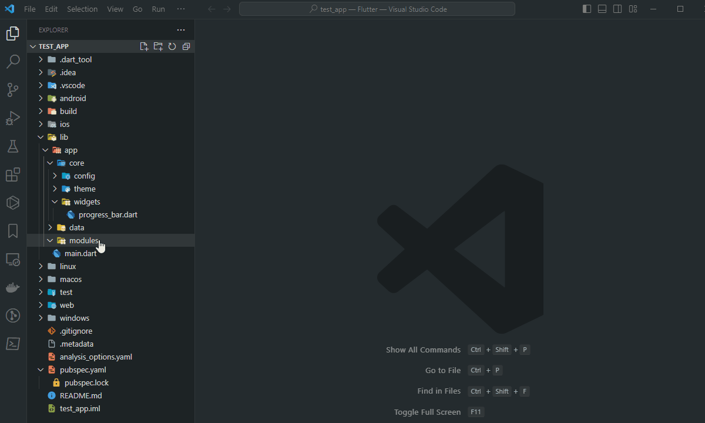
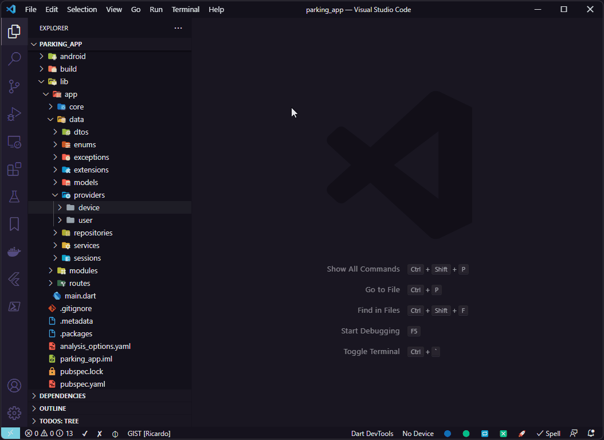
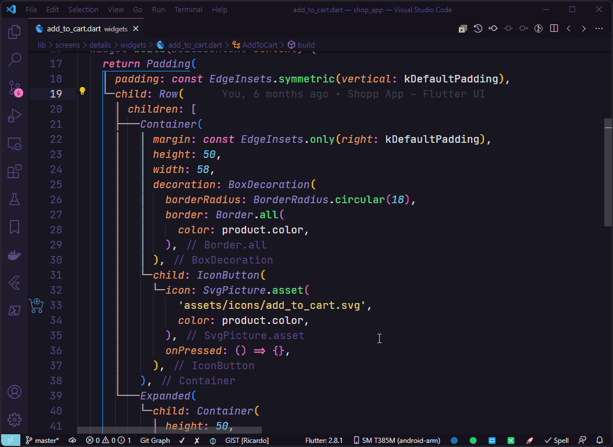

   
  

# What's new in Flutter Tools Pro 4.0 🎉

- Added the command `✨ Read pubspec.yaml to enable Flutter Tools Pro features`.
- Added the command `Open User Settings for Flutter Tools Pro`.
- Added the command `Open Workspace Settings for Flutter Tools Pro`.
- Added the command `➖ Take Previous Value` to decremente values between values (2, 4, 6, 8, 10, 12, 14, 16, 20, 24, 28,
  32, 36, 40, 44, 48, 56, 64, 80, 96, 112,
  128, 144, 160, 176, 192, 208, 224, 240, 256, 288, 320, 384).
- Added the command `➕ Take Next Value` to increment values between values (2, 4, 6, 8, 10, 12, 14, 16, 20, 24, 28, 32,
  36, 40, 44, 48, 56, 64, 80, 96, 112,
  128, 144, 160, 176, 192, 208, 224, 240, 256, 288, 320, 384).
- Added the event `onSave:pubspec.yaml` to execute the command
  `✨ Read pubspec.yaml to enable Flutter Tools Pro features`.
- Added the context menu item `📂 Create Riverpod App Structure`.
- Added the context menu item `📑 Create Riverpod Feature` with GoRouter support case it's in use.
- Added the context menu item `📝 Create Final Class` only for Dart 3+.
- Added the context menu item `📝 Create Sealed Class` only for Dart 3+.
- Updated the `Flutter Modular Module` to support versions 5 and 6.
- Added the item `Wrap with Consumer`.
- Added the item `Wrap with CustomScrollView and SliverList and SliverChildBuilderDelegate`.
- Added the item `Wrap with SliverList and SliverChildBuilderDelegate`.
- Added the item `Wrap with Offstage`.
- Added the setting `projectViewsPath`.
- Added `Riverpod` snippets.
- Improve extension settings.
- Removed the setting `projectsPath`.
- Updated `Widget` snippets.

## ✨Important Update: License Change for the Extension

The Flutter Tools extension is now fully paid. Since its launch, this extension has been designed to streamline and
enhance Flutter development in Visual Studio Code. Initially offered for free, then under a freemium model, we are now
taking the next step to ensure its sustainability and continued development.

### 💡 Why this change?

Maintaining and improving an extension like Flutter Tools requires ongoing time and resources. With the paid model, we
can:

✅ Continuously improve and add new features.  
✅ Provide better support for users.  
✅ Deliver regular updates to keep the extension compatible with new versions of Flutter and Visual Studio Code.

### 🔑 How to get your subscription?

To continue using Flutter Tools Pro and gain access to
exclusive features like advanced framework support (GetX, MobX, Riverpod and Flutter Modular), custom template
generation, and much more, you can purchase a paid license through the [Extensions Hub](https://extensionshub.com.br),
where we offer flexible payment options.

### How to get started?

Visit [https://extensionshub.com.br](https://extensionshub.com.br) now, where you can choose your plan, and unlock all
premium
features in just a few clicks.

#### How to Register Your Subscription

Ready to unlock the premium features of **Flutter Tools Pro** in Visual Studio Code? Follow these simple steps to
register your subscription
using your subscription key:

1. **Open the Command Palette**

- In Visual Studio Code, press `Ctrl + Shift + P` (Windows/Linux) or `Cmd + Shift + P` (Mac) to open the Command
  Palette.

2. **Select the Subscription Option in the Command Palette**

- Type "Flutter Tools Pro" and select:  
  ✏️ **Add/Update Subscription Code for Flutter Tools Pro**

3. **Enter Your Subscription Key that you copied from Extensions Hub**

- A text input will appear. Paste the subscription key you received after purchasing your plan
  at [https://extensionshub.com.br](https://extensionshub.com.br).
- Press `Enter` to submit.

4. **Name Your Device**

- Another input will pop up. Enter a name for your device (e.g., "Work Laptop" or "Home PC") to help you identify it
  later.
- Press `Enter` to confirm.

5. **Enjoy Premium Features!**

- Once validated, you’ll have instant access to all **Pro features 🎖️**. Start boosting your Flutter workflow right
  away!

🙌 Thank you for your support!

We recognize that this change, making the extension fully paid, may impact some users, but we believe it will allow the
extension to
continue growing and providing even more value to the Flutter community.

Thank you for being part of this journey! If you have any questions, feel free to reach out. 🚀
!

Best regards,

**Ricardo Emerson**    
The Flutter Tools Pro Team
---

# Flutter Tools Pro

This extension creates Stateless Widgets, Stateful Widgets, GetX, Riverpod, Flutter Modular features as well as MobX
Store, Classes, Interfaces, and you can also apply to existing widgets new wrappers in your Flutter projects.

## Features

| Feature                                                             | Type        |
|---------------------------------------------------------------------|-------------|
| Create Stateless/Stateful Widgets                                   | Pro feature |
| Basic Dart classes                                                  | Pro feature |
| Dart Interfaces (Repositories, Providers and Services)              | Pro feature |
| Advanced framework support GetX, RiverPod, Flutter Modular and MobX | Pro feature |
| Custom template generation                                          | Pro feature |
| Priority bug fixes and support                                      | Pro feature |
| Wrappers                                                            | Pro feature |
| Snippets                                                            | Free        |

# Usage Examples

> All the examples shown below were performed using the extension's default settings. In your project feel free to
> customize as you wish.

## ✨ Flutter Tools Pro now read your pubspec.yaml file!

Since the Flutter Tools Pro extension has many features, in order to prevent the context menu from becoming cluttered
with items that won't be used in your projects, the Flutter Tools Pro extension now reads the pubspec.yaml file and,
based on the installed packages, enables or disables context menu items.

Among the supported packages, we have: **GetX**, **Riverpod**, **Flutter Modular**, and **MobX**.

So, let's begin the demonstration of using the extension, first without any of these packages installed, and then we'll
see the role of each one.

## Widgets

### Create Stateless Widget as Component:

### Create Stateless Widget as Page:

### Create Stateful Widget as Component:

### Create Stateful Widget as Page:

### Settings for Creating Pages with Widgets

#### Create folder for Widgets Pages

#### Suffix for Widgets as Pages (Page, Screen or View)

To create a Stateless Widget, right-click on the folder where the widget will be created, choose
`🔶 Create Stateless Widget` and inform the name of the widget that will be created.

## Create Stateful Widget Example:

To create a Stateful Widget, right-click on the folder where the widget will be created, choose
`🔷 Create Stateful Widget` and inform the name of the widget that will be created.

# GetX

## Create GetX App Structure Example:

> You need to have the `get` package installed in your `pubspec.yaml`

To create a GetX App Structure, right-click on the `lib` folder and choose `📂 Create GetX App Structure`.

The folders that will be created by the command `📂 Create GetX App Structure`:

If you not will use some folder, just delete it from your project.

## Create GetX Feature Example:

> You need to have the `get` package installed in your `pubspec.yaml`

To create a GetX resource that is composed of the `view`, `controller`, `binding` and `route` files, right-click on the
`modules` folder or any subfolder inside it and choose `📑 Create GetX Feature`.

You can create a folder to group GetX resources. In this case the name of the route file will be the name of the folder
created, as we can see in the example below:

## Create GetX Service Example:

> You need to have the `get` package installed in your `pubspec.yaml`

To create a GetX Service, right-click on the desired folder and choose  `🗃️ Create GetX Service`.

# MobX

## Create MobX Store

> You need to have the `mobx and flutter_mobx` package installed in your `pubspec.yaml`

To create a MobX Store, right-click on the desired folder and choose `📦 Create MobX Store`.

# Interface for Providers, Repositories and Services

## Create Provider Interface Example:

Select the folder where the Provider Interface will be created and choose `📄 Create Provider Interface` and enter the
name of the provider interface to be created.

## Create Repository Interface Example:

Select the folder where the Repository Interface will be created and choose `📄 Create Repository Interface` and enter
the name of the repository interface to be created.

## Create Service Interface Example:

Select the folder where the Service Interface will be created and choose `📄 Create Service Interface` and enter the name
of the service interface to be created.

# Classes

## Create Class Example:

Select the folder where the class will be created and choose `📝 Create Dart Class` and enter the name of the class to be
created.

## Create Controller Example:

Select the folder where the controller will be created and choose `📝 Create Controller` and enter the name of the
controller to be created.

## Create DTO Example:

Select the folder where the DTO will be created and choose `📝 Create DTO` and enter the name of the DTO to be created.

## Create Interface Example:

Select the folder where the interface will be created and choose `📝 Create Interface` and enter the name of the
interface to be created.

## Create Model Example:

Select the folder where the model will be created and choose `📝 Create Model` and enter the name of the model to be
created.

## Create Singleton Class Example:

Select the folder where the model will be created and choose `📝 Create Singleton Class` and enter the name of the
singleton class to be created.

# Code Actions

## Code action Implements Interface:

In interfaces files it is possible to use the code action `Implements interface` to create interface implementation file
case it is not implemented yet or when already exists and you want create another implementation of interface.

# Extra wrappers

Use the code actions of Visual Studio Code to wrap a widget with one of the following wrappers:

- `Wrap with LayoutBuilder`
- `Wrap with Expanded`
- `Wrap with Stack`
- `Wrap with Positioned`
- `Wrap with Align`
- `Wrap with ClipRRect`
- `Wrap with Hero`
- `Wrap with GestureDetector`
- `Wrap with SingleChildScrollView`
- `Wrap with SafeArea`
- `Wrap with Form`
- `Wrap with Obx`
- `Wrap with Observer`

## Wrap with LayoutBuilder

## Wrap with Expanded

## Wrap with Stack

## Wrap with Positioned

## Wrap with Align

## Wrap with ClipRRect

## Wrap with Hero

## Wrap with GestureDetector

## Wrap with SingleChildScrollView

## Wrap with SafeArea

## Wrap with Form

## Wrap with Obx

In case of use of `GetX`, it is possible to wrapper a widget that uses an observable property with the widget `Obx` from
lib [`get`](https://pub.dev/packages/get).

## Wrap with Observer

In case of use of `MobX`, it is possible to wrapper a widget that uses an observable property with the widget `Observer`
from lib [`flutter_mobx`](https://pub.dev/packages/flutter_mobx).

## If wrap fails and breaks the code?

In some widgets structures by positioning the cursor over the widget which will be surrounded by new widget may cause
breaking the code.

In this case, undo the last operation and select all the widget that will be wrapped using the shortcut `Alt` + `W`,
then use Visual Studio Code `code actions` and choose the appropriate wrapper.

# Snippets

All snippets are available through prefix `ft-`.

## Flutter and Dart

| Snippet                                                               | Description                                                                    |
|-----------------------------------------------------------------------|--------------------------------------------------------------------------------|
| `ft-imp-dart-date`                                                    | Adds Dart Date import                                                          |
| `ft-part`                                                             | Adds (.g) part file for main file                                              |
| `ft-part-of`                                                          | Adds part of main file                                                         |
| `ft-get-file-name`                                                    | Adds current filename in pascal case                                           |
| `ft-class`                                                            | Creates a class for the current file                                           |
| `ft-constructor-class`                                                | Creates a class constructor for the current file                               |
| `ft-constructor-class-with-named-params`                              | Creates a class constructor for the current file with named params             |
| `ft-private-construtor`                                               | Creates a private class constructor for the current file                       |
| `ft-private-attribute`                                                | Creates a private class attribute                                              |
| `ft-constr-inject-firebase-auth`                                      | Creates an injection for Firebase Auth - Complete                              |
| `ft-add-inject-firebase-auth`                                         | Adds an injection for Firebase Auth - Parts to include                         |
| `ft-constr-inject-controller`                                         | Creates an injection for Controller - Complete                                 |
| `ft-add-inject-controller`                                            | Adds an injection for Controller - Parts to include                            |
| `ft-constr-inject-i-class`                                            | Creates an injection for IClass - Complete                                     |
| `ft-constr-inject-class`                                              | Creates an injection for Class - Complete                                      |
| `ft-add-inject-i-class`                                               | Creates an injection for IClass - Parts to include                             |
| `ft-add-inject-class`                                                 | Creates an injection for Class - Parts to include                              |
| `ft-constr-inject-i-service`                                          | Creates an injection for IService - Complete                                   |
| `ft-constr-inject-service`                                            | Creates an injection for Service - Complete                                    |
| `ft-add-inject-i-service`                                             | Creates an injection for IService - Parts to include                           |
| `ft-add-inject-service`                                               | Creates an injection for Service - Parts to include                            |
| `ft-constr-inject-i-repository`                                       | Creates an injection for IRepository - Complete                                |
| `ft-constr-inject-repository`                                         | Creates an injection for Repository - Complete                                 |
| `ft-add-inject-i-repository`                                          | Adds an injection for IRepository - Parts to include                           |
| `ft-add-inject-repository`                                            | Adds an injection for Repository - Parts to include                            |
| `ft-constr-inject-session`                                            | Creates an injection for Session - Complete                                    |
| `ft-add-inject-session`                                               | Adds an injection for Session - Parts to include                               |
| `ft-constr-inject-i-provider`                                         | Creates an injection for IProvider - Complete                                  |
| `ft-constr-inject-provider`                                           | Creates an injection for Provider - Complete                                   |
| `ft-add-inject-i-provider`                                            | Adds an injection for IProvider - Parts to include                             |
| `ft-add-inject-provider`                                              | Adds an injection for Provider - Parts to include                              |
| `ft-constr-inject-rest-client`                                        | Creates an injection for RestClient - Complete                                 |
| `ft-add-inject-rest-client`                                           | Adds an injection for RestClient - Parts to include                            |
| `ft-constr-inject-i-api-storage`                                      | Creates an injection for ApiCacheStorageService - Complete                     |
| `ft-add-inject-i-api-storage`                                         | Adds an injection for ApiCacheStorageService - Parts to include                |
| `ft-constr-inject-i-local-storage`                                    | Creates an injection for ILocalStorageService - Complete                       |
| `ft-constr-inject-local-storage`                                      | Creates an injection for LocalStorageService - Complete                        |
| `ft-add-inject-i-local-storage`                                       | Adds an injection for ILocalStorageService - Parts to include                  |
| `ft-add-inject-local-storage`                                         | Adds an injection for LocalStorageService - Parts to include                   |
| `ft-constr-inject-i-session-storage`                                  | Creates an injection for ISessionStorageService - Complete                     |
| `ft-constr-inject-session-storage`                                    | Creates an injection for SessionStorageService - Complete                      |
| `ft-add-inject-i-session-storage`                                     | Adds an injection for ISessionStorageService - Parts to include                |
| `ft-add-inject-session-storage`                                       | Adds an injection for SessionStorageService - Parts to include                 |
| `ft-constr-inject-rest-client-with-i-api-storage`                     | Creates an injection for RestClient and ApiCacheStorageService - Complete      |
| `ft-if-not`                                                           | Creates an if denying the condition                                            |
| `ft-if-return`                                                        | Creates an if with return if condition was truthy                              |
| `ft-if-not-return`                                                    | Creates an if with return if condition was falsy                               |
| `ft-if-not-mounted`                                                   | Creates an if with return if StateFull Widget it'n mounted                     |
| `ft-if-context-not-mounted`                                           | Creates an if with return if context it'n mounted                              |
| `ft-if-context-mounted`                                               | Creates an if for mounted context                                              |
| `ft-if-null`                                                          | Creates an if for null condition                                               |
| `ft-if-not-null`                                                      | Creates an if for not null condition                                           |
| `ft-if-contains`                                                      | Creates an if for check if String contains term                                |
| `ft-cm-basic`                                                         | Creates a basic comment                                                        |
| `ft-cm-block`                                                         | Creates a block comment                                                        |
| `ft-cm-section`                                                       | Creates a section comment                                                      |
| `ft-cm-subsection`                                                    | Creates a subsection comment                                                   |
| `ft-cm-section-footer`                                                | Creates a footer comment                                                       |
| `ft-cm-element-block`                                                 | Creates a documentation comment                                                |
| `ft-delayed-zero`                                                     | Adds a Future.delayed(Duration.zero) instruction                               |
| `ft-delayed-seconds`                                                  | Adds a Future.delayed instruction                                              |
| `ft-delayed-seconds-with-callback`                                    | Adds a Future.delayed instruction with a callback function                     |
| `ft-duration`                                                         | Adds a Duration instruction                                                    |
| `ft-final-void-function`                                              | Adds property as a void Function()                                             |
| `ft-final-void-call-back`                                             | Adds property as a VoidCallback function                                       |
| `ft-form-key`                                                         | Adds a variable of type GlobalKey<FormState>()                                 |
| `ft-form-key-private`                                                 | Adds a private variable of type GlobalKey<FormState>()                         |
| `ft-focus-node`                                                       | Adds a variable of type FocusNode()                                            |
| `ft-focus-node-private`                                               | Adds a private variable of type FocusNode()                                    |
| `ft-text-editing-controller`, `ft-editing-controller`                 | Adds a variable of type TextEditingController()                                |
| `ft-text-editing-controller-private`, `ft-editing-controller-private` | Adds a private variable of type TextEditingController()                        |
| `ft-list-from-map-and-json`                                           | Adds two functions fromMap and fromJson to create lists from map data          |
| `ft-prop-eq`                                                          | Adds a key and value assignment to an object where the key and value are equal |
| `ft-prop-eq-map`                                                      | Adds a key and value assignment to an map where the key and value are equal    |
| `ft-throw-exception`                                                  | Adds the instruction throw Exception()                                         |
| `ft-throw-app-exception`                                              | Adds the instruction throw AppException()                                      |
| `ft-throw-auth-exception`                                             | Adds the instruction throw AuthException()                                     |
| `ft-await`                                                            | Adds the instruction await                                                     |
| `ft-final-simple`                                                     | Adds a simple assignment variable                                              |
| `ft-final-await`                                                      | Adds a future assignment variable                                              |
| `ft-final-future-wait`                                                | Adds a future assignment variable for multiple futures processing              |
| `ft-build-context`                                                    | Adds a declaration for BuildContext                                            |
| `ft-date-format-dd-mm-yyyy`                                           | Adds a variable of type DateFormat('dd/MM/y')                                  |
| `ft-future-method`                                                    | Adds a Future method                                                           |
| `ft-future-void-method`                                               | Adds a Future void method                                                      |
| `ft-void-method`                                                      | Adds a void method                                                             |
| `ft-form-is-valid`                                                    | Check if a form is valid                                                       |
| `ft-get-property`                                                     | Adds a get property                                                            |
| `ft-static-get-property`                                              | Adds a static get property                                                     |
| `ft-signature-static-method`                                          | Add a signature to a static method                                             |
| `ft-signature-method`                                                 | Add a signature to method                                                      |
| `ft-static-method`                                                    | Adds a static method                                                           |
| `ft-signature-future-static-method`                                   | Adds a signature of a future static method                                     |
| `ft-signature-future-method`                                          | Adds a signature of a future method                                            |
| `ft-future-static-method`                                             | Adds a future static method                                                    |
| `ft-value-notifier`                                                   | Creates a ValueNotifier attribute                                              |
| `widgets-binding-add-post-frame-callback`                             | Adds WidgetsBinding.instance.addPostFrameCallback() to be used in initState()  |

## Widgets

| Snippet                                            | Description                                                                     |
|----------------------------------------------------|---------------------------------------------------------------------------------|
| `ft-border-side`                                   | Adds borderSide property using BorderSide() with width and color                |
| `ft-border-side-color`                             | Adds borderSide property using BorderSide() with color                          |
| `ft-shape-circle-border`                           | Adds a shape property using CircleBorder()                                      |
| `ft-shape-rounded-rectangle-border`                | Adds a shape property using RoundedRectangleBorder()                            |
| `ft-main-axis-size`                                | Adds mainAxisSize property using MainAxisSize to Row() or Column()              |
| `ft-main-axis-alignment`                           | Adds mainAxisAlignment property using MainAxisAlignment to Row() or Column()    |
| `ft-cross-axis-alignment`                          | Adds crossAxisAlignment property using CrossAxisAlignment to Row() or Column()  |
| `ft-alignment`                                     | Adds alignment property using Alignment                                         |
| `ft-wrap-alignment`                                | Adds alignment property using WrapAlignment                                     |
| `ft-wrap-cross-axis-alignment`                     | Adds crossAxisAlignment property using WrapCrossAlignment                       |
| `ft-font-weight`                                   | Adds FontWeight                                                                 |
| `ft-text-decoration`                               | Adds TextDecoration for Underline, LineThrough, Overline and Combine Options    |
| `ft-text-decoration-thickness`                     | Adds TextDecoration Thickness                                                   |
| `ft-text-align`                                    | Adds TextAlign                                                                  |
| `ft-0xff`, `ft-hex-color`                          | Adds a Hexadecimal Color                                                        |
| `ft-color-hex`                                     | Adds a color property using a Hexadecimal Color                                 |
| `ft-color`                                         | Adds a color property using Colors                                              |
| `ft-background-color`                              | Adds a backgroundColor property using Colors                                    |
| `ft-background-color-hex`                          | Adds a backgroundColor property using a Hexadecimal Color                       |
| `ft-color-theme`                                   | Adds a color property using Theme.of(context)                                   |
| `ft-theme-of`                                      | Adds a color using Theme.of(context)                                            |
| `ft-text-overflow`                                 | Adds an overflow property using TextOverflow.ellipsis                           |
| `ft-space-vertical`, `ft-separator-vertical`       | Adds a vertical spacing between widgets using SizedBox                          |
| `ft-space-horizontal`, `ft-separator-horizontal`   | Adds a horizontal spacing between widgets using SizedBox                        |
| `ft-gap`                                           | Adds a horizontal or vertical spacing between widgets using Gap                 |
| `ft-space-shrink`                                  | Adds a SizedBox.shrink()                                                        |
| `ft-margin-all`                                    | Adds margin property using EdgeInsets.all()                                     |
| `ft-margin-symmetric`                              | Adds margin property using EdgeInsets.symmetric()                               |
| `ft-margin-only`                                   | Adds margin property using EdgeInsets.only()                                    |
| `ft-padding-all`                                   | Adds padding property using EdgeInsets.all()                                    |
| `ft-content-padding-all`                           | Adds contentPadding property using EdgeInsets.all()                             |
| `ft-padding-symmetric`                             | Adds padding property using EdgeInsets.symmetric()                              |
| `ft-content-padding-symmetric`                     | Adds contentPadding property using EdgeInsets.symmetric()                       |
| `ft-padding-only`                                  | Adds padding property using EdgeInsets.only()                                   |
| `ft-content-padding-only`                          | Adds contentPadding property using EdgeInsets.only()                            |
| `ft-padding-zero`                                  | Adds padding property using EdgeInsets.zero                                     |
| `ft-content-padding-zero`                          | Adds contentPadding property using EdgeInsets.zero                              |
| `ft-edge-insets-zero`                              | Adds EdgeInsets.zero                                                            |
| `ft-border-all`                                    | Adds border property using Border.all()                                         |
| `ft-border-symmetric`                              | Adds border property using Border.symmetric()                                   |
| `ft-bouncing-scroll-physics`                       | Adds physics property using BouncingScrollPhysics()                             |
| `ft-direction`                                     | Adds direction property using Axis                                              |
| `ft-scroll-direction`                              | Adds scrollDirection property using Axis                                        |
| `ft-navigator-pop`                                 | Adds Navigator instruction using pop                                            |
| `ft-navigator-pop-until`                           | Adds Navigator instruction using popUntil                                       |
| `ft-navigator-pop-and-push-named`                  | Adds Navigator instruction using popAndPushNamed                                |
| `ft-navigator-push-named`                          | Adds Navigator instruction using pushNamed                                      |
| `ft-navigator-push-replacement-named`              | Adds Navigator instruction using pushReplacementNamed                           |
| `ft-navigator-push-named-and-remove-util`          | Adds Navigator instruction using pushNamedAndRemoveUntil                        |
| `ft-navigator-of-pop`                              | Adds Navigator.of(context) instruction using pop                                |
| `ft-navigator-of-pop-until`                        | Adds Navigator.of(context) instruction using popUntil                           |
| `ft-navigator-of-pop-and-push-named`               | Adds Navigator.of(context) instruction using popAndPushNamed                    |
| `ft-navigator-of-push-named`                       | Adds Navigator.of(context) instruction using pushNamed                          |
| `ft-navigator-of-push-replacement-named`           | Adds Navigator.of(context) instruction using pushReplacementNamed               |
| `ft-navigator-of-push-named-and-remove-util`       | Adds Navigator.of(context) instruction using pushNamedAndRemoveUntil            |
| `ft-navigator-pop`                                 | Adds Navigator instruction using pop                                            |
| `ft-navigator-push-named`                          | Adds Navigator instruction using pushNamed                                      |
| `ft-navigator-push-named-and-remove-util`          | Adds Navigator instruction using pushNamedAndRemoveUntil                        |
| `ft-navigator-push`                                | Adds Navigator instruction using MaterialPageRoute                              |
| `ft-navigator-push-and-remove-until`               | Adds Navigator instruction using PageRouteBuilder                               |
| `ft-media-query`                                   | Adds MediaQuery instruction using size                                          |
| `ft-app-bar-theme`                                 | Adds appBarTheme property using AppBarTheme()                                   |
| `ft-app-bar-brightness`                            | Adds brightness property using Brightness                                       |
| `ft-text-style`                                    | Adds style property using TextStyle() with color, fontSize and fontWeight       |
| `ft-text-style-weight`                             | Adds style property using TextStyle() only for fontWeight                       |
| `ft-text-style-size`                               | Adds style property using TextStyle() only for fontSize                         |
| `ft-text-style-color`                              | Adds style property using TextStyle() only for color                            |
| `ft-text-style-theme-of`                           | Adds style property using Theme.of(context).textTheme                           |
| `ft-image-asset`                                   | Adds Image Widget from assets                                                   |
| `ft-image-asset-plus`                              | Adds Image Widget from assets with properties height, width and fit             |
| `ft-image-network`                                 | Adds Image Widget from network                                                  |
| `ft-image-network-plus`                            | Adds Image Widget from network with properties height, width and fit            |
| `ft-fit-box-fit`                                   | Adds fit property using BoxFit                                                  |
| `ft-icon-button`                                   | Adds IconButton Widget with properties icon, color, iconSize and onPressed      |
| `ft-elevated-rectangle-button`                     | Adds ElevatedButton Widget using BorderRadius()                                 |
| `ft-elevated-circ-button`                          | Adds ElevatedButton Widget using CircleBorder()                                 |
| `ft-decoration`                                    | Adds decoration property using BoxDecoration                                    |
| `ft-input-decoration`                              | Adds decoration property using InputDecoration                                  |
| `ft-decoration-with-decoration-image`              | Adds decoration property using BoxDecoration and DecorationImage                |
| `ft-decoration-asset-image`                        | Adds image property using DecorationImage and AssetImage                        |
| `ft-decoration-network-image`                      | Adds image property using DecorationImage and NetworkImage                      |
| `ft-shape-with-border-radius`                      | Adds shape property using RoundedRectangleBorder with BorderRadius.circular()   |
| `ft-decoration-with-border-radius`                 | Adds decoration property using BoxDecoration with BorderRadius.circular()       |
| `ft-border-radius`                                 | Adds borderRadius property using BorderRadius.circular()                        |
| `ft-shape-with-border-radius-only`                 | Adds shape property using RoundedRectangleBorder with BorderRadius.only()       |
| `ft-decoration-with-border-radius-only`            | Adds decoration property using BoxDecoration with BorderRadius.only()           |
| `ft-border-radius-only`                            | Adds borderRadius property using BorderRadius.only()                            |
| `ft-shape-with-border-radius-vertical`             | Adds shape property using RoundedRectangleBorder with BorderRadius.vertical()   |
| `ft-decoration-with-border-radius-vertical`        | Adds decoration property using BoxDecoration with BorderRadius.vertical()       |
| `ft-border-radius-vertical`                        | Adds borderRadius property using BorderRadius.vertical()                        |
| `ft-shape-with-border-radius-horizontal`           | Adds shape property using RoundedRectangleBorder with BorderRadius.horizontal() |
| `ft-decoration-with-border-radius-horizontal`      | Adds decoration property using BoxDecoration with BorderRadius.horizontal()     |
| `ft-border-radius-horizontal`                      | Adds borderRadius property using BorderRadius.horizontal()                      |
| `ft-decoration-with-box-shadow`                    | Adds decoration property using BoxDecoration with BoxShadow                     |
| `ft-box-shadow`                                    | Adds boxShadow property using BoxShadow                                         |
| `ft-decoration-with-box-shadow-bottom-sheet`       | Adds decoration property using BoxDecoration with BoxShadow for Bottom Sheet    |
| `ft-box-shadow-bottom-sheet`                       | Adds boxShadow property using BoxShadow for Bottom Sheet                        |
| `ft-column`                                        | Adds Column Widget                                                              |
| `ft-row`                                           | Adds Row Widget                                                                 |
| `ft-wrap`                                          | Adds Wrap Widget                                                                |
| `ft-stack`                                         | Adds Stack Widget                                                               |
| `ft-custom-scroll-view-with-sliver-to-box-adapter` | Adds CustomScrollView Widget with SliverToBoxAdapter                            |
| `ft-custom-scroll-view-with-sliver-fill-remaining` | Adds CustomScrollView Widget with SliverFillRemaining                           |
| `ft-text`                                          | Adds Text Widget                                                                |
| `ft-text-style-context`                            | Adds Text Widget with style from context. (Needs extensions created)            |
| `ft-text-span`                                     | Adds TextSpan Widget with text property                                         |
| `ft-text-span-children`                            | Adds TextSpan Widget with children property                                     |
| `ft-outlined-icon-button`                          | Adds OutlinedButton Widget with Icon                                            |
| `ft-status-bar-icon-brightness`                    | Sets the color for statusBarIconBrightness                                      |
| `ft-text-input-action`, `ft-input-action`          | Adds textInputAction property using TextInputAction                             |
| `ft-text-capitalization`                           | Adds textCapitalization property using TextCapitalization                       |
| `ft-keyboard-type`, `ft-input-type`                | Adds keyboardType property using TextInputType                                  |
| `ft-ensure-initialized`                            | Adds the instruction WidgetsFlutterBinding.ensureInitialized();                 |
| `ft-scaffold`                                      | Adds Scaffold Widget                                                            |
| `ft-popup-menu-button`                             | Adds PopupMenuButton Widget                                                     |
| `ft-constraints-box-constraints`                   | Adds constraints property using BoxConstraints                                  |
| `ft-add-initialize-date-formatting`                | Adds initializeDateFormatting()                                                 |
| `ft-add-locales-pt-br`                             | Adds localizations for pt-BR                                                    |
| `ft-text-shadow`                                   | Adds shadows property using Shadow to use in Text Widget                        |
| `ft-text-rich`                                     | Adds Text.rich Widget                                                           |
| `ft-font-size-values`                              | Adds the font sizes values                                                      |
| `ft-padding-values`                                | Adds the padding values                                                         |
| `ft-space-values`, `ft-separator-values`           | Adds the space/separator values                                                 |
| `ft-border-radius-values`                          | Adds the border radius values                                                   |
| `ft-border-side-values`                            | Adds the border side values                                                     |
| `ft-icon`                                          | Adds an icon from Google Fonts                                                  |
| `ft-phosphor-icon`                                 | Adds an icon from PhosphorIcon package                                          |
| `ft-navigator-context`                             | Get the Navigator.of(context)                                                   |

## GetX

| Snippet                           | Description                                                                 |
|-----------------------------------|-----------------------------------------------------------------------------|
| `ft-imp-get`                      | Adds GetX import                                                            |
| `ft-rx-attribute`                 | Creates a Rx attribute                                                      |
| `ft-rxn-attribute`                | Creates a Rxn attribute                                                     |
| `ft-obs-attribute`                | Creates a GetX Observable attribute                                         |
| `ft-get-size`                     | Uses GetX to get width or height of screen                                  |
| `ft-get-find`                     | Adds the Get.find() the get instance of class using GetX                    |
| `ft-get-width`                    | Uses GetX to get width of screen                                            |
| `ft-get-height`                   | Uses GetX to get height of screen                                           |
| `ft-width-get-width`              | Adds width property using Get.width                                         |
| `ft-height-get-height`            | Adds width property using Get.height                                        |
| `ft-get-put-service`              | Adds Get.put() instruction for Service()                                    |
| `ft-get-put-service-impl`         | Adds Get.put() instruction for ServiceImpl()                                |
| `ft-get-put-session`              | Adds Get.put() instruction for Session()                                    |
| `ft-get-put-repository`           | Adds Get.put() instruction for Repository()                                 |
| `ft-get-put-repository-impl`      | Adds Get.put() instruction for RepositoryImpl()                             |
| `ft-get-put-provider`             | Adds Get.put() instruction for Provider()                                   |
| `ft-get-put-provider-impl`        | Adds Get.put() instruction for ProviderImpl()                               |
| `ft-get-view`                     | Adds GetView instruction for get instance of controller inside view         |
| `ft-get-put-controller`           | Adds Get.put() instruction for Controller()                                 |
| `ft-get-lazy-put-controller`      | Adds Get.lazyPut() instruction for Controller()                             |
| `ft-get-lazy-put-provider`        | Adds Get.lazyPut() instruction for Provider() used by a Service()           |
| `ft-get-lazy-put-provider-impl`   | Adds Get.lazyPut() instruction for ProviderImpl() used by a ServiceImpl()   |
| `ft-get-lazy-put-service`         | Adds Get.lazyPut() instruction for Service()                                |
| `ft-get-lazy-put-service-impl`    | Adds Get.lazyPut() instruction for ServiceImpl()                            |
| `ft-get-lazy-put-repository`      | Adds Get.lazyPut() instruction for Repository() used by a Service()         |
| `ft-get-lazy-put-repository-impl` | Adds Get.lazyPut() instruction for RepositoryImpl() used by a ServiceImpl() |
| `ft-on-init`                      | Adds override for onInit method                                             |
| `ft-on-ready`                     | Adds override for onReady method                                            |
| `ft-on-close`                     | Adds override for onClose method                                            |

## Provider

| Snippet                              | Description                                                                           |
|--------------------------------------|---------------------------------------------------------------------------------------|
| `ft-context-read-provider`           | Adds the context.read() to get instance of class using Provider                       |
| `ft-context-read-provider-data`      | Adds the context.read<type>() to get instance of Controller class using Provider      |
| `ft-context-watch-provider`          | Adds the context.watch<type>() to watch instance of class using Provider              |
| `ft-context-select-provider`         | Adds the context.select<ClassName, type>() to select instance of class using Provider |
| `ft-provider-create`                 | Adds Provider() instruction for Bloc, Cubit or Controller                             |
| `ft-provider-create-class`           | Adds Provider() instruction for for IClass                                            |
| `ft-provider-create-class-impl`      | Adds Provider() instruction for for Class                                             |
| `ft-provider-create-controller`      | Adds Provider() instruction for Controller()                                          |
| `ft-provider-create-provider`        | Adds Provider() instruction for Provider() used by a Service()                        |
| `ft-provider-create-provider-impl`   | Adds Provider() instruction for ProviderImpl() used by a ServiceImpl()                |
| `ft-provider-create-service`         | Adds Provider() instruction for Service()                                             |
| `ft-provider-create-service-impl`    | Adds Provider() instruction for ServiceImpl()                                         |
| `ft-provider-create-repository`      | Adds Provider() instruction for Repository() used by a Service()                      |
| `ft-provider-create-repository-impl` | Adds Provider() instruction for RepositoryImpl() used by a ServiceImpl()              |

## Bloc/Cubit

| Snippet                    | Description                            |
|----------------------------|----------------------------------------|
| `ft-bloc-router`           | Creates a Bloc Router Module           |
| `ft-bloc-router-with-args` | Creates a Bloc Router Module with args |
| `ft-get-navigation-args`   | Get args from ModalRoute               |

## Modular

| Snippet                                     | Description                                                                                              |
|---------------------------------------------|----------------------------------------------------------------------------------------------------------|
| `ft-modular-get`                            | Adds the Modular.get() the get instance of class using Flutter Modular                                   |
| `ft-modular-get-data`                       | Adds the Modular.get<type>() to get instance of Controller class using Flutter Modular                   |
| `ft-modular-get-controller`                 | Adds the Modular.get() for controller the get instance of class using Flutter Modular                    |
| `ft-modular-get-of-type`                    | Adds the Modular.get<Class>() to get instance of class using Flutter Modular                             |
| `ft-modular-to-navigate`                    | Navigate to a new screen                                                                                 |
| `ft-modular-to-push-named`                  | Navigate to a route                                                                                      |
| `ft-module-route-v5`                        | Adds ModuleRoute to Module                                                                               |
| `ft-child-route-v5`                         | Adds ChildRoute to Module                                                                                |
| `ft-child-route-with-router-outlet-v5`      | Adds ChildRoute with RouterOutlet to Module                                                              |
| `ft-bind-lazy-singleton-class-v5`           | Adds Bind.lazySingleton() instruction for any Class using Flutter Modular                                |
| `ft-bind-lazy-singleton-class-impl-v5`      | Adds Bind.lazySingleton() instruction for any ClassImpl using Flutter Modular                            |
| `ft-bind-lazy-singleton-controller-v5`      | Adds Bind.lazySingleton() instruction for Controller using Flutter Modular                               |
| `ft-bind-lazy-singleton-repository-v5`      | Adds Bind.lazySingleton() instruction for Repository() used by a Service() using Flutter Modular         |
| `ft-bind-lazy-singleton-repository-impl-v5` | Adds Bind.lazySingleton() instruction for RepositoryImpl() used by a ServiceImpl() using Flutter Modular |
| `ft-bind-lazy-singleton-service-v5`         | Adds Bind.lazySingleton() instruction for Service() using Flutter Modular                                |
| `ft-bind-lazy-singleton-service-impl-v5`    | Adds Bind.lazySingleton() instruction for ServiceImpl() using Flutter Modular                            |
| `ft-module-route-v6`                        | Adds ModuleRoute to Module                                                                               |
| `ft-child-route-v6`                         | Adds ChildRoute to Module                                                                                |
| `ft-bind-lazy-singleton-class-v6`           | Adds i.addLazySingleton() instruction for any Class using Flutter Modular                                |
| `ft-bind-lazy-singleton-class-impl-v6`      | Adds i.addLazySingleton() instruction for any ClassImpl using Flutter Modular                            |
| `ft-bind-lazy-singleton-controller-v6`      | Adds i.addLazySingleton() instruction for Controller using Flutter Modular                               |
| `ft-bind-lazy-singleton-repository-v6`      | Adds i.addLazySingleton() instruction for Repository() used by a Service() using Flutter Modular         |
| `ft-bind-lazy-singleton-repository-impl-v6` | Adds i.addLazySingleton() instruction for RepositoryImpl() used by a ServiceImpl() using Flutter Modular |
| `ft-bind-lazy-singleton-service-v6`         | Adds i.addLazySingleton() instruction for Service() using Flutter Modular                                |
| `ft-bind-lazy-singleton-service-impl-v6`    | Adds i.addLazySingleton() instruction for ServiceImpl() using Flutter Modular                            |

## Riverpod

| Snippet                                | Description                                 |
|----------------------------------------|---------------------------------------------|
| `ft-riverpod-provider-rest-client`     | Adds Riverpod provider for RestClient()     |
| `ft-riverpod-provider-class`           | Adds Riverpod provider for class()          |
| `ft-riverpod-provider-session-class`   | Adds Riverpod provider for Session class()  |
| `ft-riverpod-provider-repository`      | Adds Riverpod provider for Repository()     |
| `ft-riverpod-provider-repository-impl` | Adds Riverpod provider for RepositoryImpl() |
| `ft-riverpod-provider-service`         | Adds Riverpod provider for Service()        |
| `ft-riverpod-provider-service-impl`    | Adds Riverpod provider for ServiceImpl()    |

## Linter (analysis_options.yaml)

| Snippet                            | Description                                               |
|------------------------------------|-----------------------------------------------------------|
| `ft-linter-analyzer`               | Configures the analyzer options                           |
| `ft-linter-rules`                  | Includes many rules for the linter to improve development |
| `ft-build-runner-options-bloc`     | Configures the build-runner options for Bloc              |
| `ft-build-runner-options-riverpod` | Configures the build-runner options for Riverpod          |

# Settings

The **Flutter Tools Pro** has many settings that change it's behavior when creating Interfaces, GetX Features and MobX
Store.

> The previous name of extension was **Create Widgets and Classes for Flutter** and now the name it's **Flutter Tools
Pro**. So in your VSCode the name of extension in settings will be the new name.

## Create Folder for Interfaces

Defines if it will create a folder to contain the **interface** and **implementation** only for `Providers`,
`Repositories` and `Services`.

## Create Implementation of Interface

Defines whether the implementation class of an interface will be created together.

## GetX Display Context Menu

Defines if the context menu with GetX features will be displayed.

## GetX Project Path

Default path for the GetX Project folders and files.

## GetX Use Constructor Tear-offs

Defines if the Bindings and Routes files will use the new Dart language feature named Constructor tear-offs.

## GetX View Suffix

Default suffix name for the GetX view layer.

## MobX Display Context Menu

Defines if the context menu with MobX features will be displayed.

## MobX File Suffix

Default suffix name for the MobX store.

## Use `I` Prefix For Interfaces

Defines whether an interface will be created using `I` with prefix to the interface name..

**That's all, Enjoy!**
