# Flutter Tools Pro

  <a href="https://github.com/ricardoemerson/create-flutter-widgets-and-classes/blob/main/README.md">English</a> | 🌐 <b>Português</b>

   
  

  
  
  
  
  

---

## 🚀 Acelere seu Desenvolvimento Flutter

O **Flutter Tools Pro** é uma suíte de produtividade de alta performance para Visual Studio Code, desenvolvida especificamente para desenvolvedores que trabalham com arquiteturas Flutter modernas. Ele automatiza a criação de widgets, classes e estruturas complexas de funcionalidades nos principais frameworks de gerenciamento de estado do mercado.

### 💎 Principais Benefícios
- **Automação Arquitetural**: Gere pastas completas de funcionalidades (View, Controller, Binding, Route) para GetX, Riverpod e Modular instantaneamente.
- **Contexto Inteligente**: Ativa/desativa recursos automaticamente lendo seu arquivo `pubspec.yaml`.
- **Erradicação de Boilerplate**: Mais de 160 snippets otimizados e ações de código inteligentes para envolver (wrap) widgets.

---

## 🛠 Recursos

| Categoria | Capacidade | Nível |
| :--- | :--- | :---: |
| **Frameworks** | GetX, Riverpod, Flutter Modular, MobX | **PRO** |
| **Geradores** | Widgets Stateless/Stateful (Página ou Componente) | **PRO** |
| **Arquitetura** | Interfaces, Repositórios, DTOs, Serviços | **PRO** |
| **Produtividade** | Geração de Templates Customizados | **PRO** |
| **Ações de Código** | Wrappers Inteligentes (LayoutBuilder, Obx, etc.) | **PRO** |
| **Snippets** | 160+ Utilitários Dart & Flutter | **GRÁTIS** |

---

## 🔑 Licenciamento e Primeiros Passos

Inicialmente oferecido gratuitamente, o Flutter Tools agora é uma extensão paga para garantir sua sustentabilidade e melhoria contínua.

### Como Registrar sua Assinatura
1. Visite o [Extensions Hub](https://extensionshub.com.br) para adquirir seu plano.
2. Abra a **Paleta de Comandos** (`Ctrl+Shift+P` / `Cmd+Shift+P`).
3. Selecione ✏️ **Add/Update Subscription Key for Flutter Tools Pro**.
4. Insira sua chave e dê um nome ao seu dispositivo.

---

## 🎬 Exemplos de Uso

> Todos os exemplos seguem as configurações padrão. Sinta-se à vontade para personalizá-los conforme a arquitetura do seu projeto.

### Widgets (Componentes e Páginas)
Gere widgets `Stateless` ou `Stateful` com estruturas pré-definidas.

| Ação | Página | Componente |
| :--- | :---: | :---: |
| **Stateless** | 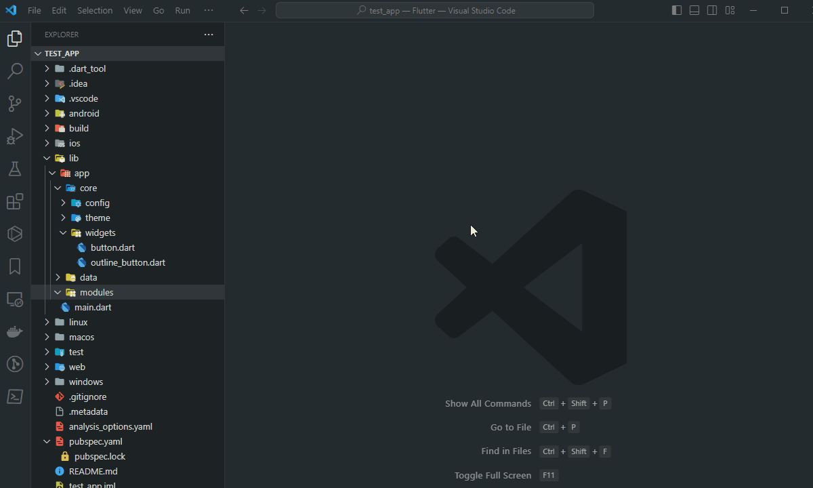 | 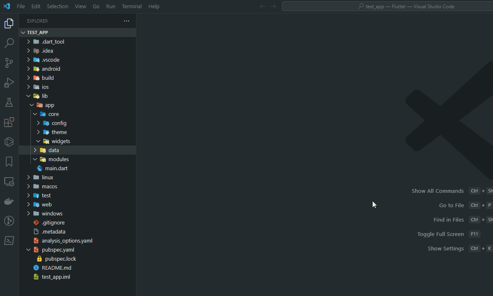 |
| **Stateful** | 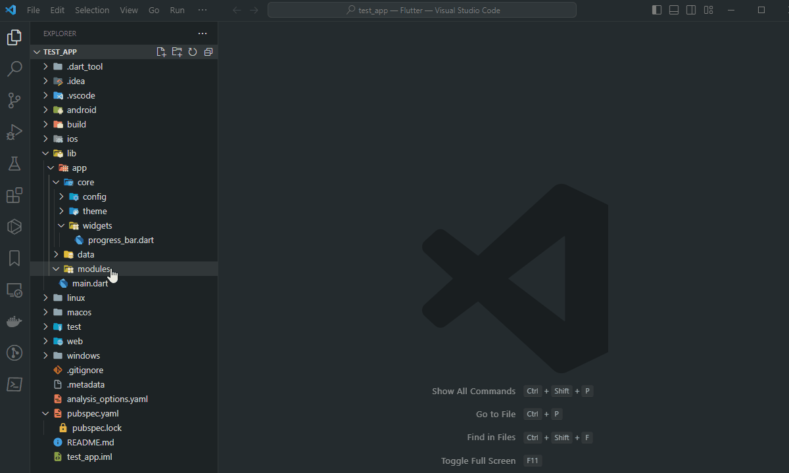 | 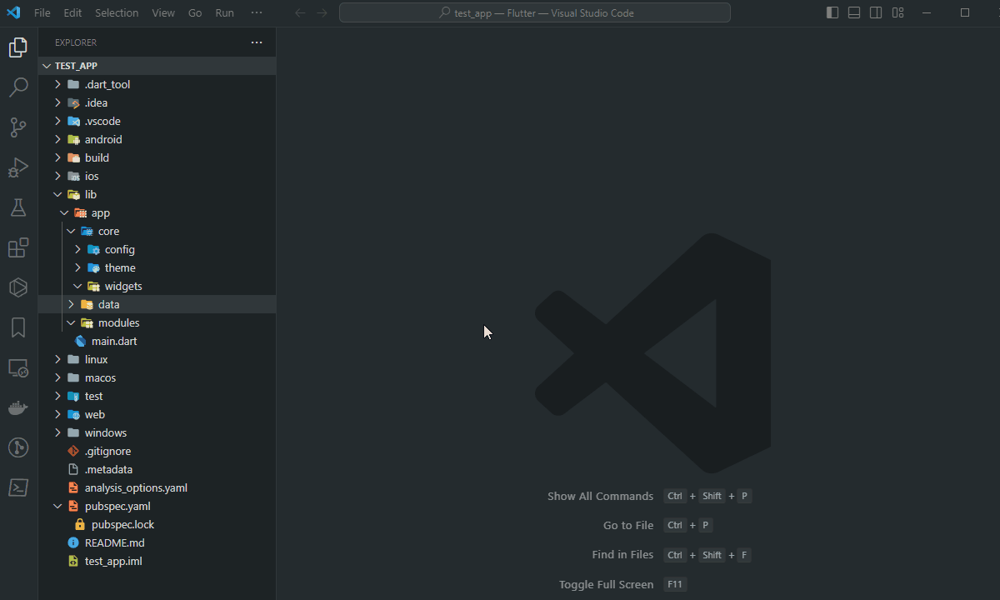 |

<b>Ver Integrações Avançadas de Frameworks (GetX, MobX, etc.)</b>

### Tipos de Widgets Customizados

### Criar Stateless Widget como Componente:

### Criar Stateless Widget como Página:

### Criar Stateful Widget como Componente:

### Criar Stateful Widget como Página:

### Configurações para Criar Páginas com Widgets

#### Criar pasta para Páginas de Widgets

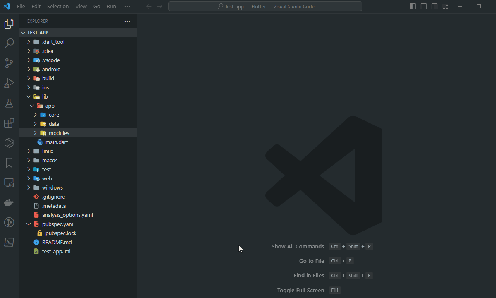

#### Sufixo para Widgets como Páginas (Page, Screen ou View)

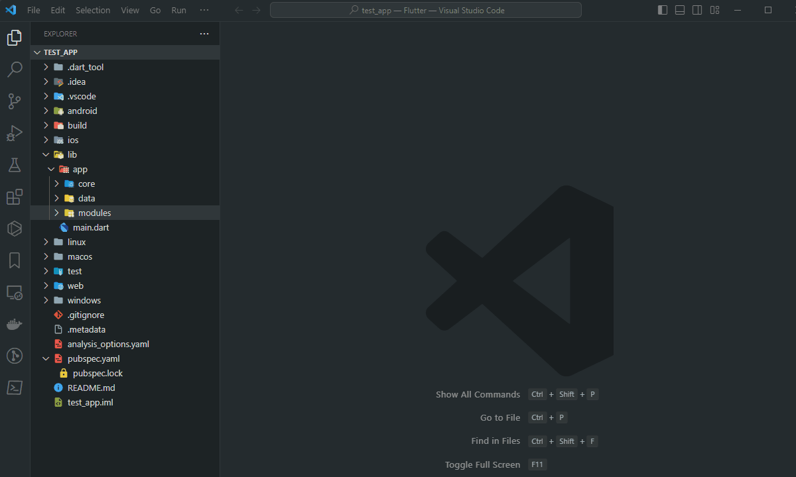

Para criar um Stateless Widget, clique com o botão direito na pasta onde o widget será criado, escolha `🔶 Create Stateless Widget` e informe o nome do widget.

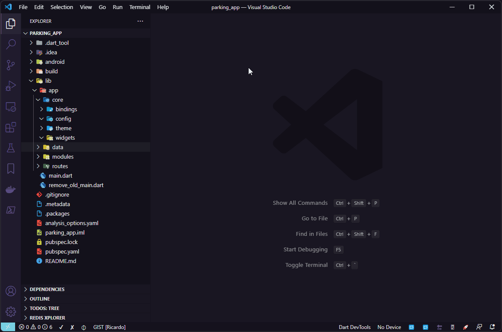

## Exemplo de Criar Stateful Widget:

Para criar um Stateful Widget, clique com o botão direito na pasta onde o widget será criado, escolha `🔷 Create Stateful Widget` e informe o nome do widget.

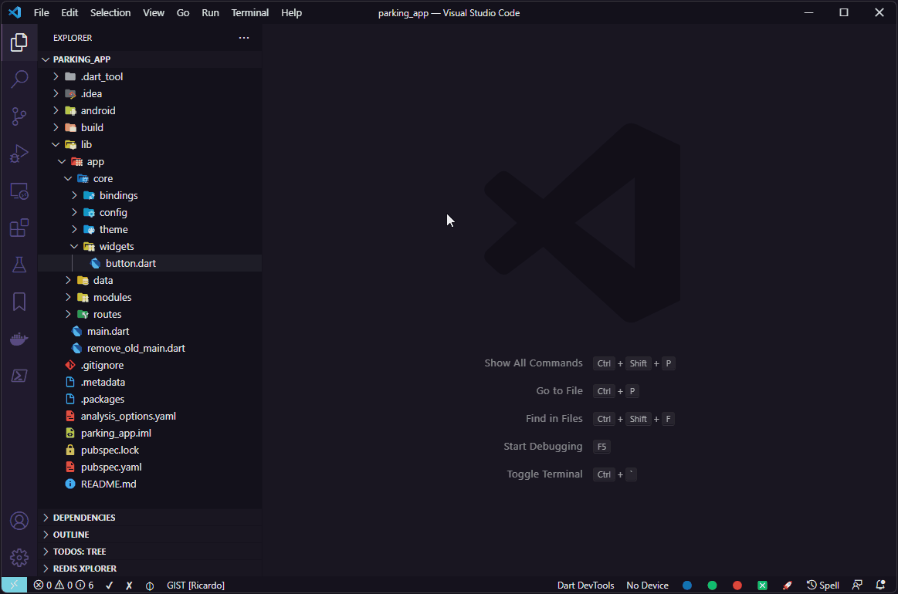

### Arquitetura Moderna GetX
Gere automaticamente bindings, controllers e rotas.
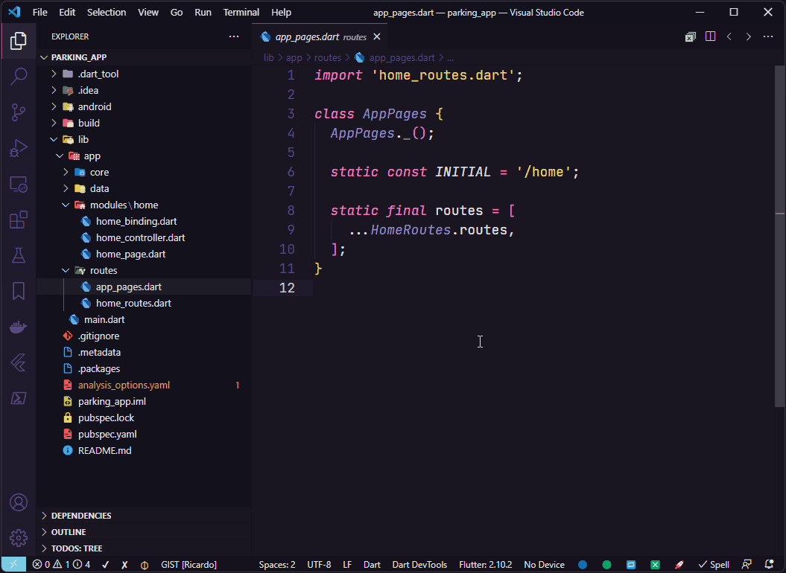

### MobX Stores
Geração de stores sem boilerplate.
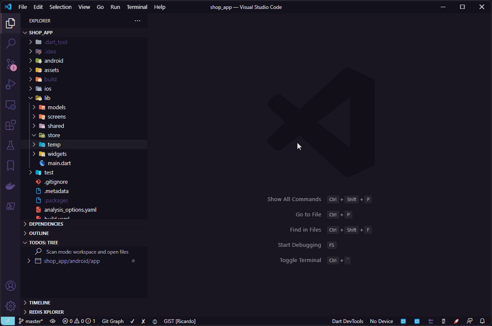

### Camadas de Domínio
Crie interfaces profissionais para Providers, Repositories e Services.
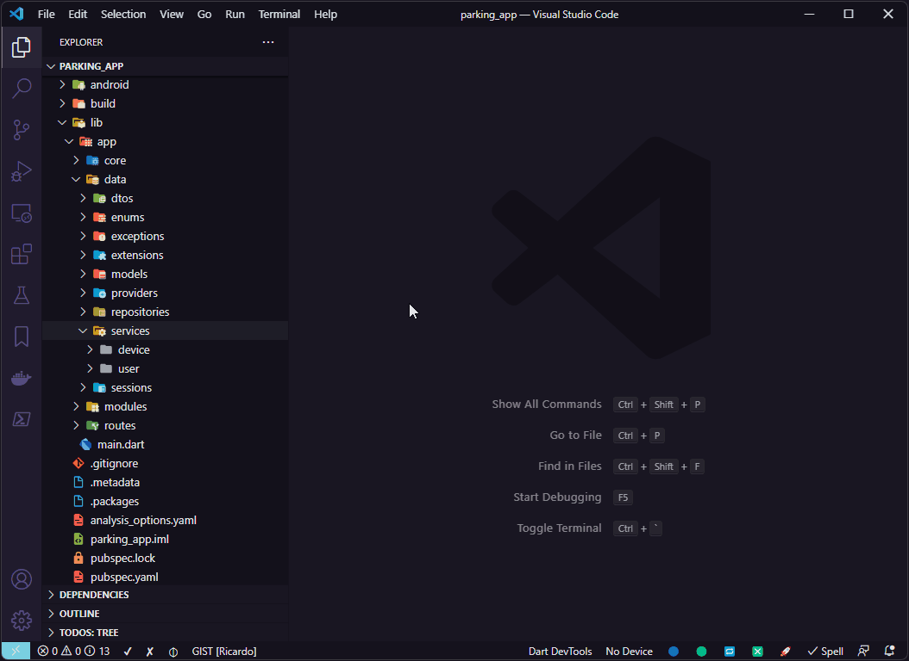

### Classes Base
Gere DTOs, Models e Singletons com padrões de mercado.
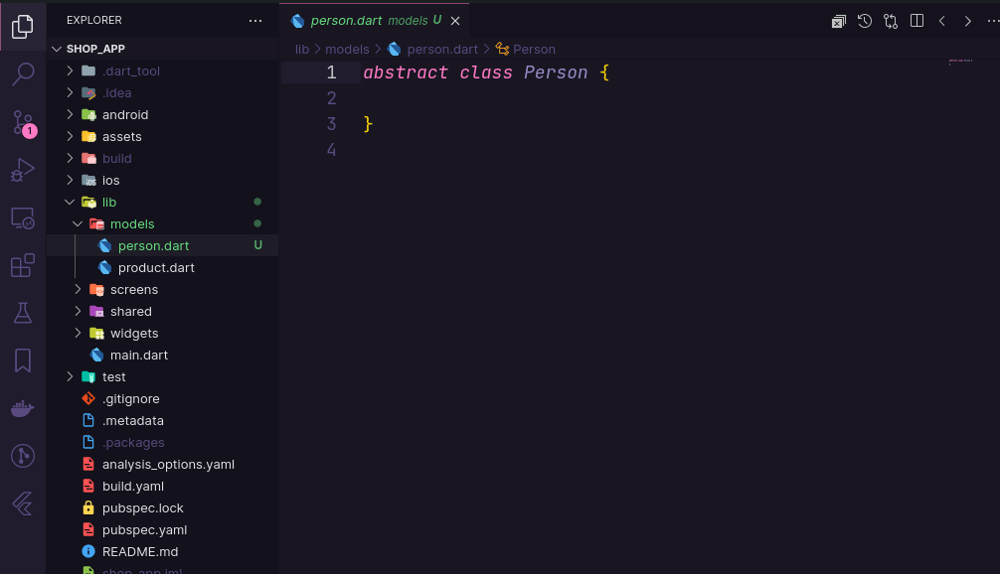

---

## 🛠 Ações de Código Pro

Envolva (wrap) widgets de forma inteligente usando as ações de código do Visual Studio Code.
> **Dica**: Use `Alt + W` para selecionar todo o widget antes de aplicar um wrapper para 100% de precisão.

<b>Ver Todos os 15+ Wrappers e Ferramentas Disponíveis</b>

### Implementação Inteligente de Interface
Gere automaticamente arquivos de implementação a partir de definições de interface.
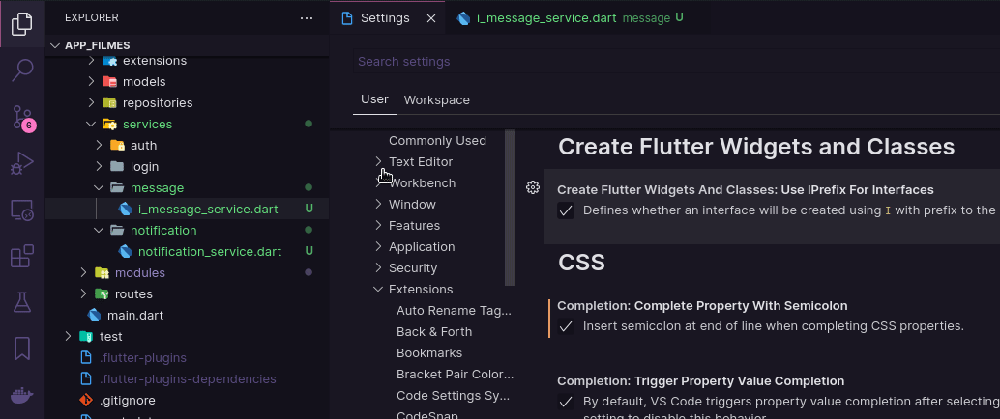

### Wrappers Abrangentes
As ações disponíveis incluem:
- `Wrap with LayoutBuilder`
- `Wrap with Expanded`, `Stack`, `Positioned`, `Align`
- `Wrap with ClipRRect`, `Hero`, `GestureDetector`
- `Wrap with SingleChildScrollView`, `SafeArea`, `Form`
- `Wrap with Obx` (GetX), `Observer` (MobX)

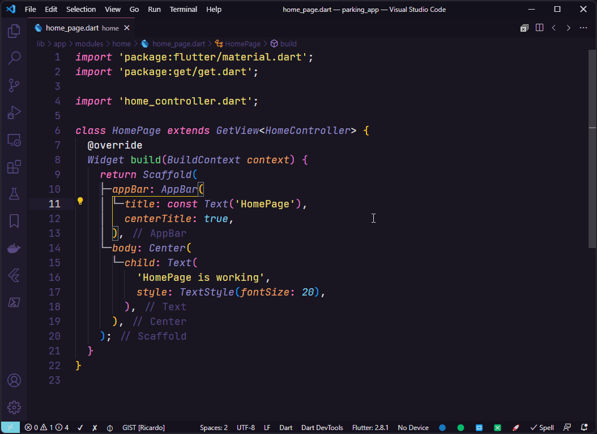

> **Aviso de Segurança**: Ao envolver estruturas complexas, use o modo de seleção para evitar quebra de sintaxe.
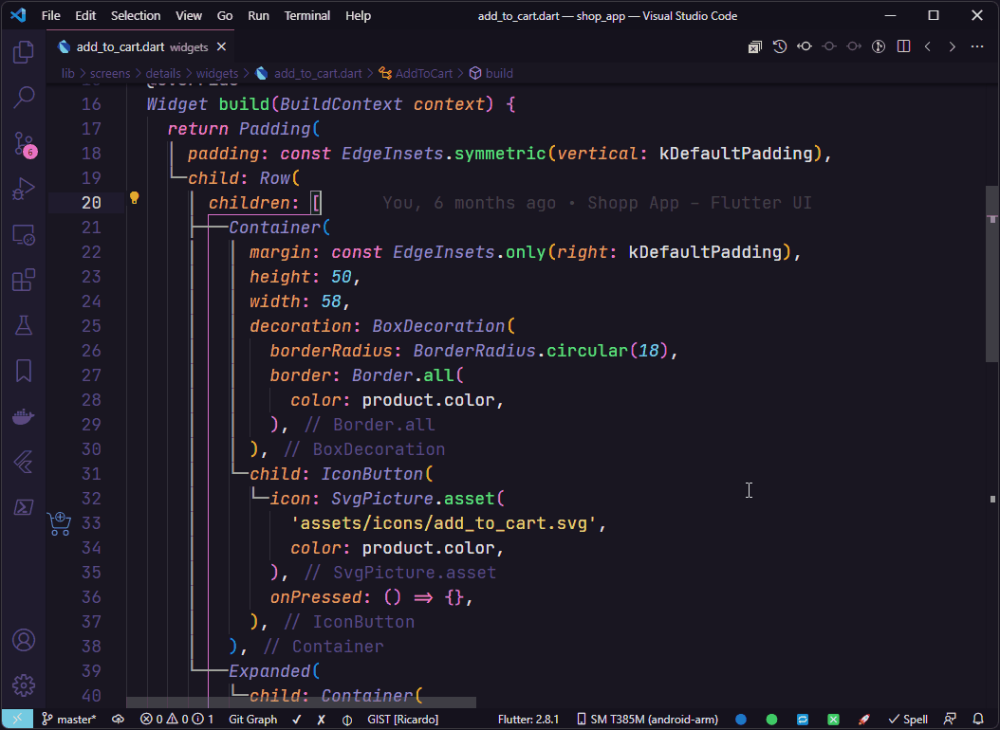

## ⚡ Biblioteca de Snippets (160+)

Acesse snippets de alta velocidade usando o prefixo `ft-`.

<b>Expandir Documentação Completa de Snippets</b>

## Flutter e Dart

| Snippet | Descrição |
|:---|:---|
| `ft-imp-dart-date` | Adiciona import de Data do Dart |
| `ft-part` | Adiciona arquivo part (.g) para o arquivo principal |
| `ft-part-of` | Adiciona part of do arquivo principal |
| `ft-get-file-name` | Adiciona o nome do arquivo atual em Pascal Case |
| `ft-class` | Cria uma classe para o arquivo atual |
| `ft-constructor-class` | Cria um construtor de classe para o arquivo atual |
| `ft-constructor-class-with-named-params` | Cria um construtor com parâmetros nomeados |
| `ft-private-construtor` | Cria um construtor privado |
| `ft-private-attribute` | Cria um atributo privado |
| `ft-constr-inject-firebase-auth` | Cria injeção para Firebase Auth - Completo |
| `ft-add-inject-firebase-auth` | Adiciona injeção para Firebase Auth - Partes |
| `ft-constr-inject-controller` | Cria injeção para Controller - Completo |
| `ft-add-inject-controller` | Adiciona injeção para Controller - Partes |
| `ft-constr-inject-i-class` | Cria injeção para IClass - Completo |
| `ft-constr-inject-class` | Cria injeção para Class - Completo |
| `ft-add-inject-i-class` | Cria injeção para IClass - Partes |
| `ft-add-inject-class` | Cria injeção para Class - Partes |
| `ft-constr-inject-i-service` | Cria injeção para IService - Completo |
| `ft-constr-inject-service` | Cria injeção para Service - Completo |
| `ft-add-inject-i-service` | Cria injeção para IService - Partes |
| `ft-add-inject-service` | Cria injeção para Service - Partes |
| `ft-constr-inject-i-repository` | Cria injeção para IRepository - Completo |
| `ft-constr-inject-repository` | Cria injeção para Repository - Completo |
| `ft-add-inject-i-repository` | Adiciona injeção para IRepository - Partes |
| `ft-add-inject-repository` | Adiciona injeção para Repository - Partes |
| `ft-constr-inject-session` | Cria injeção para Session - Completo |
| `ft-add-inject-session` | Adiciona injeção para Session - Partes |
| `ft-constr-inject-i-provider` | Cria injeção para IProvider - Completo |
| `ft-constr-inject-provider` | Cria injeção para Provider - Completo |
| `ft-add-inject-i-provider` | Adiciona injeção para IProvider - Partes |
| `ft-add-inject-provider` | Adiciona injeção para Provider - Partes |
| `ft-constr-inject-rest-client` | Cria injeção para RestClient - Completo |
| `ft-add-inject-rest-client` | Adiciona injeção para RestClient - Partes |
| `ft-constr-inject-i-api-storage` | Cria injeção para ApiCacheStorageService - Completo |
| `ft-add-inject-i-api-storage` | Adiciona injeção para ApiCacheStorageService - Partes |
| `ft-constr-inject-i-local-storage` | Cria injeção para ILocalStorageService - Completo |
| `ft-constr-inject-local-storage` | Cria injeção para LocalStorageService - Completo |
| `ft-add-inject-i-local-storage` | Adiciona injeção para ILocalStorageService - Partes |
| `ft-add-inject-local-storage` | Adiciona injeção para LocalStorageService - Partes |
| `ft-constr-inject-i-session-storage` | Cria injeção para ISessionStorageService - Completo |
| `ft-constr-inject-session-storage` | Cria injeção para SessionStorageService - Completo |
| `ft-add-inject-i-session-storage` | Adiciona injeção para ISessionStorageService - Partes |
| `ft-add-inject-session-storage` | Adiciona injeção para SessionStorageService - Partes |
| `ft-constr-inject-rest-client-with-i-api-storage` | Cria injeção para RestClient e ApiCacheStorageService - Completo |
| `ft-if-not` | Cria um if negando a condição |
| `ft-if-return` | Cria um if com return se a condição for verdadeira |
| `ft-if-not-return` | Cria um if com return se a condição for falsa |
| `ft-if-not-mounted` | Cria um if com return se o StatefulWidget não estiver montado |
| `ft-if-context-not-mounted` | Cria um if com return se o contexto não estiver montado |
| `ft-if-context-mounted` | Cria um if para contexto montado |
| `ft-if-null` | Cria um if para condição nula |
| `ft-if-not-null` | Cria um if para condição não nula |
| `ft-if-contains` | Cria um if para verificar se String contém termo |
| `ft-cm-basic` | Cria um comentário básico |
| `ft-cm-block` | Cria um comentário em bloco |
| `ft-cm-section` | Cria um comentário de seção |
| `ft-cm-subsection` | Cria um comentário de subseção |
| `ft-cm-section-footer` | Cria um comentário de rodapé |
| `ft-cm-element-block` | Cria um comentário de documentação |
| `ft-delayed-zero` | Adiciona instrução Future.delayed(Duration.zero) |
| `ft-delayed-seconds` | Adiciona instrução Future.delayed |
| `ft-delayed-seconds-with-callback` | Adiciona Future.delayed com função de callback |
| `ft-duration` | Adiciona instrução Duration |
| `ft-final-void-function` | Adiciona propriedade como void Function() |
| `ft-final-void-call-back` | Adiciona propriedade como VoidCallback |
| `ft-form-key` | Adiciona variável do tipo GlobalKey<FormState>() |
| `ft-form-key-private` | Adiciona variável privada do tipo GlobalKey<FormState>() |
| `ft-focus-node` | Adiciona variável do tipo FocusNode() |
| `ft-focus-node-private` | Adiciona variável privada do tipo FocusNode() |
| `ft-text-editing-controller` | Adiciona variável do tipo TextEditingController() |
| `ft-text-editing-controller-private` | Adiciona variável privada do tipo TextEditingController() |
| `ft-list-from-map-and-json` | Adiciona funções fromMap e fromJson para listas de dados |
| `ft-prop-eq` | Adiciona atribuição de chave e valor iguais em um objeto |
| `ft-prop-eq-map` | Adiciona atribuição de chave e valor iguais em um mapa |
| `ft-throw-exception` | Adiciona a instrução throw Exception() |
| `ft-throw-app-exception` | Adiciona a instrução throw AppException() |
| `ft-throw-auth-exception` | Adiciona a instrução throw AuthException() |
| `ft-await` | Adiciona a instrução await |
| `ft-final-simple` | Adiciona uma variável de atribuição simples |
| `ft-final-await` | Adiciona uma variável de atribuição futura |
| `ft-final-future-wait` | Adiciona processamento de múltiplos futures |
| `ft-build-context` | Adiciona declaração para BuildContext |
| `ft-date-format-dd-mm-yyyy` | Adiciona variável do tipo DateFormat('dd/MM/y') |
| `ft-future-method` | Adiciona um método Future |
| `ft-future-void-method` | Adiciona um método Future void |
| `ft-void-method` | Adiciona um método void |
| `ft-form-is-valid` | Verifica se um formulário é válido |
| `ft-get-property` | Adiciona uma propriedade get |
| `ft-get-property-private` | Adiciona uma propriedade get privada |
| `ft-static-get-property` | Adiciona uma propriedade get estática |
| `ft-signature-static-method` | Adiciona assinatura a um método estático |
| `ft-signature-method` | Adiciona assinatura a um método |
| `ft-static-method` | Adiciona um método estático |
| `ft-signature-future-static-method` | Adiciona assinatura de um método static future |
| `ft-signature-future-method` | Adiciona assinatura de um método future |
| `ft-future-static-method` | Adiciona um método static future |
| `ft-value-notifier` | Cria um atributo ValueNotifier |
| `widgets-binding-add-post-frame-callback` | Adiciona WidgetsBinding.instance.addPostFrameCallback() |

## Widgets

| Snippet | Descrição |
|:---|:---|
| `ft-border-side` | Adiciona borderSide com BorderSide() |
| `ft-border-side-color` | Adiciona borderSide apenas com cor |
| `ft-shape-circle-border` | Adiciona propriedade shape com CircleBorder() |
| `ft-shape-rounded-rectangle-border` | Adiciona propriedade shape com RoundedRectangleBorder() |
| `ft-main-axis-size` | Adiciona mainAxisSize a Row ou Column |
| `ft-main-axis-alignment` | Adiciona mainAxisAlignment a Row ou Column |
| `ft-cross-axis-alignment` | Adiciona crossAxisAlignment a Row ou Column |
| `ft-alignment` | Adiciona propriedade alignment com Alignment |
| `ft-wrap-alignment` | Adiciona propriedade alignment com WrapAlignment |
| `ft-wrap-cross-axis-alignment` | Adiciona crossAxisAlignment com WrapCrossAlignment |
| `ft-font-weight` | Adiciona FontWeight |
| `ft-text-decoration` | Adiciona TextDecoration (Underline, LineThrough, etc.) |
| `ft-text-decoration-thickness` | Adiciona espessura do TextDecoration |
| `ft-text-align` | Adiciona TextAlign |
| `ft-0xff`, `ft-hex-color` | Adiciona cor Hexadecimal |
| `ft-color-hex` | Adiciona propriedade de cor com Hexadecimal |
| `ft-color` | Adiciona propriedade de cor com Colors |
| `ft-background-color` | Adiciona propriedade backgroundColor com Colors |
| `ft-background-color-hex` | Adiciona backgroundColor com Hexadecimal |
| `ft-color-theme` | Ader cor usando Theme.of(context) |
| `ft-theme-of` | Busca cor usando Theme.of(context) |
| `ft-text-overflow` | Adiciona overflow com TextOverflow.ellipsis |
| `ft-space-vertical` | Adiciona espaçamento vertical com SizedBox |
| `ft-space-horizontal` | Adiciona espaçamento horizontal com SizedBox |
| `ft-gap` | Adiciona espaçamento usando Gap |
| `ft-space-shrink` | Adiciona um SizedBox.shrink() |
| `ft-margin-all` | Adiciona margem com EdgeInsets.all() |
| `ft-margin-symmetric` | Adiciona margem com EdgeInsets.symmetric() |
| `ft-margin-only` | Adiciona margem com EdgeInsets.only() |
| `ft-padding-all` | Adiciona padding com EdgeInsets.all() |
| `ft-content-padding-all` | Adiciona contentPadding com EdgeInsets.all() |
| `ft-padding-symmetric` | Adiciona padding com EdgeInsets.symmetric() |
| `ft-content-padding-symmetric` | Adiciona contentPadding com EdgeInsets.symmetric() |
| `ft-padding-only` | Adiciona padding com EdgeInsets.only() |
| `ft-content-padding-only` | Adiciona contentPadding com EdgeInsets.only() |
| `ft-padding-zero` | Adiciona padding com EdgeInsets.zero |
| `ft-content-padding-zero` | Adiciona contentPadding com EdgeInsets.zero |
| `ft-edge-insets-zero` | Adiciona EdgeInsets.zero |
| `ft-border-all` | Adiciona borda com Border.all() |
| `ft-border-symmetric` | Adiciona borda com Border.symmetric() |
| `ft-bouncing-scroll-physics` | Adiciona física de scroll BouncingScrollPhysics() |
| `ft-direction` | Adiciona propriedade direction com Axis |
| `ft-scroll-direction` | Adiciona scrollDirection com Axis |
| `ft-navigator-pop` | Adiciona instrução Navigator.pop |
| `ft-navigator-pop-until` | Adiciona Navigator.popUntil |
| `ft-navigator-push-named` | Adiciona Navigator.pushNamed |
| `ft-navigator-push-replacement-named` | Adiciona Navigator.pushReplacementNamed |
| `ft-navigator-of-pop` | Adiciona Navigator.of(context).pop() |
| `ft-media-query` | Adiciona instrução MediaQuery para tamanho |
| `ft-app-bar-theme` | Adiciona appBarTheme com AppBarTheme() |
| `ft-text-style` | Estilo de texto com cor, tamanho e peso |
| `ft-text-style-theme-of` | Estilo de texto do Theme.of(context).textTheme |
| `ft-image-asset` | Adiciona Widget de Imagem de assets |
| `ft-image-network` | Adiciona Widget de Imagem da rede |
| `ft-icon-button` | Adiciona Widget IconButton |
| `ft-elevated-rectangle-button` | Adiciona ElevatedButton com BorderRadius |
| `ft-decoration` | Adiciona propriedade decoration com BoxDecoration |
| `ft-input-decoration` | Adiciona decoration com InputDecoration |
| `ft-border-radius` | Adiciona borderRadius com BorderRadius.circular() |
| `ft-column` | Adiciona Widget Column |
| `ft-row` | Adiciona Widget Row |
| `ft-wrap` | Adiciona Widget Wrap |
| `ft-stack` | Adiciona Widget Stack |
| `ft-text` | Adiciona Widget Text |
| `ft-scaffold` | Adiciona Widget Scaffold |
| `ft-icon` | Adiciona ícone do Google Fonts |
| `ft-phosphor-icon` | Adiciona ícone do pacote PhosphorIcon |

## GetX

| Snippet | Descrição |
|:---|:---|
| `ft-imp-get` | Adiciona import do GetX |
| `ft-rx-attribute` | Cria um atributo Rx |
| `ft-obs-attribute` | Cria um atributo GetX Observable |
| `ft-get-size` | Usa GetX para obter tamanho da tela |
| `ft-get-find` | Adiciona Get.find() para instanciar classe |
| `ft-get-view` | Adiciona GetView para instanciar controller na view |
| `ft-get-put-controller` | Adiciona Get.put() para Controller() |
| `ft-get-lazy-put-service` | Adiciona Get.lazyPut() para Service() |
| `ft-on-init` | Adiciona override para o método onInit |
| `ft-on-ready` | Adiciona override para o método onReady |
| `ft-on-close` | Adiciona override para o método onClose |

## Outros Frameworks
Todos os outros snippets para **Provider**, **Bloc/Cubit**, **Modular** e **Riverpod** também estão disponíveis seguindo o mesmo padrão de nomenclatura rápida.

---

## ⚙️ Configurações Avançadas

Ajuste como o Flutter Tools Pro gera código para alinhar com o estilo da sua equipe.

<b>Ver Todas as Configurações Disponíveis</b>

O **Flutter Tools Pro** permite ampla personalização do comportamento para Interfaces, Recursos GetX e MobX Stores.

- **Create Folder for Interfaces**: Alterna o aninhamento automático.
- **GetX Use Constructor Tear-offs**: Suporte à sintaxe moderna do Dart.
- **Use `I` Prefix**: Impõe convenções de nomenclatura de interface.

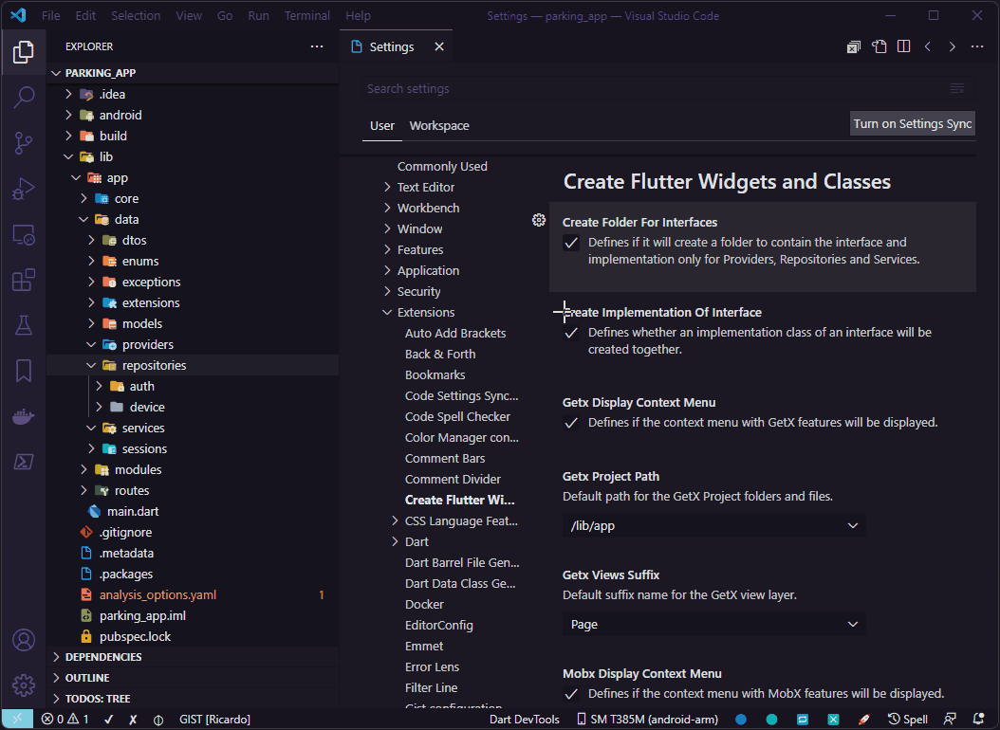

---

  <b>Aproveite o desenvolvimento Flutter em alta velocidade!</b> 
  © 2026 Extensions Hub Team

