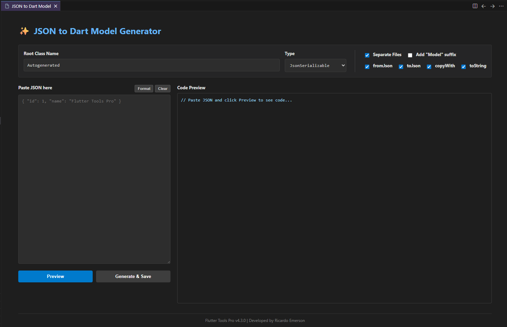
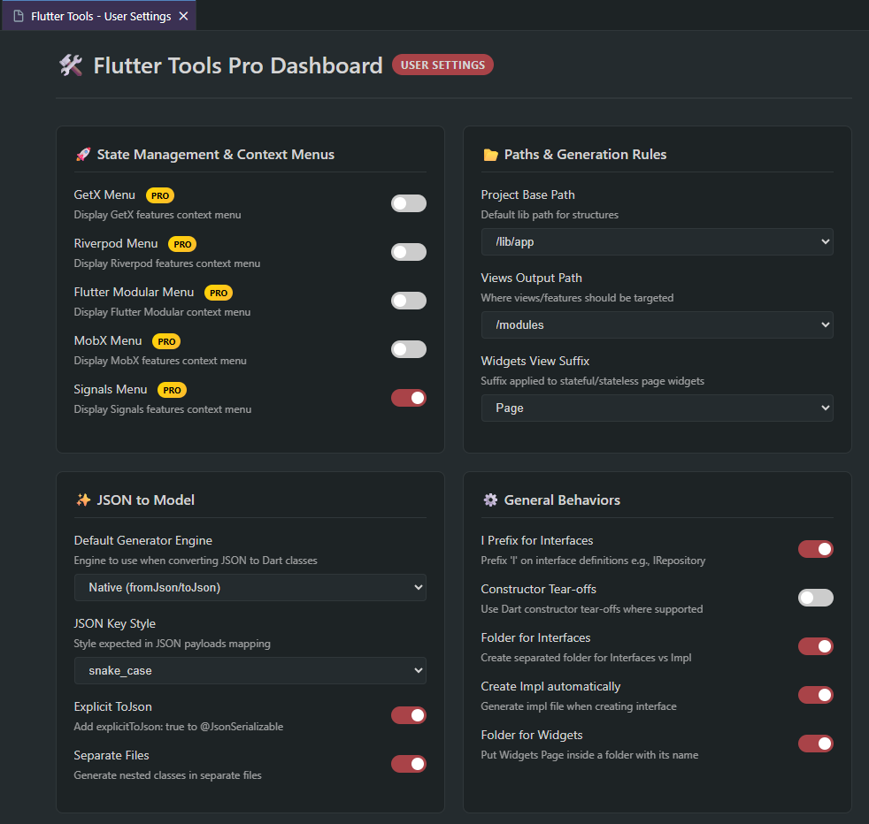

# Flutter Tools Pro

  <a href="https://github.com/ricardoemerson/create-flutter-widgets-and-classes/blob/main/README.md">English</a> | 🌐 <b>Português</b>

   
  

  
  
  
  
  

---

## 🚀 Desenvolva Flutter Mais Rápido — Sem Boilerplate

O **Flutter Tools Pro** é a extensão de produtividade que desenvolvedores Flutter estavam esperando. Ele automatiza as partes repetitivas do seu fluxo de trabalho — desde a criação de widgets até a geração completa de arquiteturas de features — para que você possa focar no que realmente importa: construir ótimos apps.

- ⚡ Gere estruturas de features completas em segundos
- 🧠 Contexto inteligente: lê o `pubspec.yaml` para habilitar só o que é relevante
- 🏗️ Suporte completo a GetX, Riverpod, Flutter Modular, MobX e Signals
- 🎯 Funciona no **VS Code**, **Cursor** e **Antigravity**

---

## ✨ Principais Funcionalidades

### 🔨 Geração de Código
- Widgets Stateless e Stateful (como Page ou Component)
- Classes, Interfaces, DTOs, Repositórios e Serviços
- MobX Stores com boilerplate de observáveis
- Geração automática de implementações a partir de interfaces

### 🏛️ Arquitetura
- Geração completa de features: View, Controller, Binding, Route
- Scaffolding de estrutura de app para GetX, Riverpod e Modular

### 🔄 JSON para Dart Model
- Converta qualquer JSON em um modelo Dart instantaneamente
- Suporta **Native**, **JsonSerializable** e **Freezed**
- Configurável: ative/desative `fromJson`, `toJson`, `copyWith`, `toString`, `explicitToJson`
- Detecta automaticamente a estratégia correta pelo `pubspec.yaml`

### ⚡ Geração de Métodos em Data Classes
- Gere ou regenere métodos boilerplate em **qualquer classe Dart existente** diretamente do editor — sem GUI.
- `fromJson` / `toJson` (Native ou JsonSerializable)
- `copyWith`
- `toString`
- Todos os geradores são **idempotentes** — se o método já existir, ele será substituído de forma limpa, nunca duplicado.

### 💡 Recursos Inteligentes
- **60+ wrappers de widget** via Code Actions (`Ctrl+.`) ou via Quick Pick (`Alt+Q`)
- **Seleção inteligente de widget** — expande a seleção para o widget inteiro (`Alt+W`)
- **Geração de métodos em Data Classes** — cria ou atualiza `fromJson`, `copyWith`, `toString` de forma idempotente
- **Pro Settings Dashboard** — interface WebView visual para configurar todas as definições (User & Workspace)
- **160+ snippets** com o prefixo `ft-`
- **Ciclo de valores numéricos** — incrementa valores com `Ctrl+Shift+,` e decrementa valores com `Ctrl+Shift+.`

---

## 🧩 Arquiteturas Suportadas

| Framework | O que gera |
| :--- | :--- |
| **GetX** | Estrutura do app, Features (View + Controller + Binding + Route), Services |
| **Riverpod** | Estrutura do app, Features, Providers |
| **Flutter Modular** | Estrutura do app, Features, Modules |
| **MobX** | Stores com atributos observáveis |
| **Signals** | Estrutura do app, Features (Flutter Modular), Controllers |

Cada gerador cria uma estrutura de pastas completa e pronta para uso. Sem configuração manual.

---

## ⚡ Por Que Times Flutter Escolhem o Flutter Tools Pro

| Sem o Flutter Tools Pro | Com o Flutter Tools Pro |
| :--- | :--- |
| Criar 5–10 arquivos manualmente por feature | Um clique direito gera toda a estrutura |
| Risco de convenções de nomes inconsistentes | Padrões de nomenclatura garantidos em todo o time |
| Copiar boilerplate de snippets ad hoc | Geração contextualizada pelo `pubspec.yaml` |
| Horas criando classes de modelo a partir de JSON | JSON para Model em menos de 10 segundos |
| Codificação manual e lenta de boilerplate (`fromJson, toJson, copyWith, toString`) | Geração instantânea e inteligente via Code Actions |

---

## 🔑 Licenciamento e Ativação

O Flutter Tools Pro é uma **extensão paga** disponível em **[extensionshub.com.br](https://extensionshub.com.br)**.

> 💡 A biblioteca com 160+ snippets está disponível **gratuitamente** para todos os usuários. Os recursos PRO exigem uma assinatura ativa.

### Como Ativar

1. Adquira seu plano em [extensionshub.com.br](https://extensionshub.com.br)
2. Copie sua chave de licença após o pagamento
3. Instale a extensão no VS Code
4. Abra a **Paleta de Comandos** (`Ctrl+Shift+P` / `Cmd+Shift+P`)
5. Execute: **✏️ Add/Update Subscription Key for Flutter Tools Pro**
6. Insira sua chave de licença e dê um nome ao seu dispositivo

---

## 🛠️ Visão Geral dos Recursos

### Geração de Widgets

Clique com o botão direito em qualquer pasta do Explorer → escolha `🔶 Create Stateless Widget` ou `🔷 Create Stateful Widget`.

#### 🔶 Create Stateless Widget
Gere widgets stateless rapidamente, escolhendo entre o padrão **Página** ou **Componente**.

- **Opção Página:**

- **Opção Componente:**

#### 🔷 Create Stateful Widget
Gere widgets stateful com estado mutável de forma automatizada, economizando tempo no boilerplate.

- **Opção Página:**

- **Opção Componente:**

---

### Geração de Features

Gere uma estrutura de feature completa com um único comando. Exemplo com GetX:

Gera: `view.dart`, `controller.dart`, `binding.dart` e `route.dart` — pré-configurados e prontos para uso.

---

### MobX Stores

---

### Interfaces e Camadas de Domínio

Crie interfaces para Services, Repositories e Providers — com arquivos de implementação gerados automaticamente.

> Use `Implements Interface` no menu de contexto do editor para gerar automaticamente a classe de implementação.

---

### JSON para Dart Model

Uma interface completa para converter JSON em modelos Dart tipados.

- Detecta automaticamente **Native**, **JsonSerializable** ou **Freezed** pelo `pubspec.yaml`
- Saída configurável: ative/desative `fromJson`, `toJson`, `copyWith`, `toString`, `explicitToJson`
- Formatador e validador de JSON integrado
- Suporta objetos aninhados em arquivos separados

---

### Geração de Métodos em Data Classes

Gere ou regenere métodos boilerplate em **qualquer classe Dart existente** diretamente pelo editor — sem interface gráfica.

| Método | Native | JsonSerializable |
| :--- | :---: | :---: |
| `fromJson` / `toJson` | ✅ | ✅ |
| `copyWith` | ✅ | ✅ |
| `toString` | ✅ | ✅ |
| `Generate All` (all at once) | ✅ | ✅ |

**Como usar:**

1. Posicione o cursor dentro de qualquer classe Dart
2. Pressione `Ctrl+.` (ou clique na lâmpada 💡)
3. Escolha a ação desejada nos Code Actions do **Flutter Tools**

> O **modo JsonSerializable** é oferecido automaticamente quando `json_serializable` é detectado no `pubspec.yaml`. Gera factories com sintaxe de seta, adiciona as anotações `@JsonSerializable` / `@JsonKey` e gerencia as diretivas `part` automaticamente.

> Todos os geradores são **idempotentes** — se o método já existir, é substituído de forma limpa. Execute quantas vezes quiser, sem gerar código duplicado.

---

### Pro Settings Dashboard

Um **dashboard WebView** completo para configurar todas as definições da extensão visualmente, sem precisar editar o `settings.json`. Suporta tanto **User Settings** (configurações globais) quanto **Workspace Settings** (por projeto).

**Grupos de configuração disponíveis:**

**Grupos de configuração disponíveis:**

- **State Management & Context Menus** — Ativa/desativa menus de contexto para GetX, Riverpod, Flutter Modular, MobX e Signals.
- **Paths & Generation Rules** — Define o caminho base do projeto, subcaminho de views e sufixo dos widgets.
- **JSON to Model** — Engine padrão (Native, Freezed, etc), estilo de chaves JSON, `explicitToJson` e gerenciamento de arquivos.
- **General Behaviors** — Configuração do prefixo `I` para interfaces, constructor tear-offs, estrutura de pastas e criação automática de impl.

> Abra via Paleta de Comandos: **⚙️ Open User Settings** (`Ctrl+O S`) ou **⚙️ Open Workspace Settings** (`Ctrl+O W`).

---

### Code Actions — Wrappers de Widget

Pressione `Alt+Q` (ou use a lâmpada 💡) para envolver qualquer widget com 60+ wrappers disponíveis.

> **Dica:** Use `Alt+W` primeiro para selecionar o widget inteiro antes de aplicar o wrapper.

**Categorias de wrappers disponíveis:**

- **Layout e Responsividade** — `LayoutBuilder`, `Expanded`, `Flexible`, `Stack`, `Positioned`, `Align`, `SafeArea`, `Center`, `Column`, `Row`, `Container`, `Padding`, `SizedBox`, `Card`, `Wrap`, `IntrinsicHeight/Width`
- **Rolagem e Slivers** — `SingleChildScrollView`, `ListView.builder`, `GridView.builder`, `CustomScrollView` (7+ variantes), `SliverAppBar`, `SliverList`, `SliverToBoxAdapter`, `SliverFillRemaining`
- **Estilização e Formas** — `ClipRRect`, `Hero`, `FittedBox`, `FractionallySizedBox`, `DecoratedBox`, `ColoredBox`
- **Interação e Formulários** — `GestureDetector`, `InkWell`, `CallbackShortcuts`, `Form`, `PopScope`, `FormField`
- **Gerenciamento de Estado** — `Obx` (GetX), `Observer` (MobX), `Consumer` (Riverpod), `ValueListenableBuilder`, `Watch` (Signals)
- **Visibilidade e Lógica** — `Visibility`, `Offstage`, `SliverVisibility`, `If (Child)`, `If (Children)`

---

### Wrappers Bloc / Cubit (Atalhos de Teclado)

- `Ctrl+B S` — **BlocSelector**
- `Ctrl+B B` — **BlocBuilder**
- `Ctrl+B C` — **BlocConsumer**
- `Ctrl+B L` — **BlocListener**
- `Ctrl+B P` — **BlocProvider**
- `Ctrl+B R` — **RepositoryProvider**

---

## ⚡ Biblioteca de Snippets (160+)

Use o prefixo `ft-` para acessar qualquer snippet. Todos os snippets estão **disponíveis gratuitamente**.

<b>Expandir Referência Completa de Snippets</b>

### Flutter & Dart

| Snippet | Descrição |
|---|---|
| `ft-imp-dart-date` | Import de Date do Dart |
| `ft-part` | Adiciona arquivo `.g` part |
| `ft-part-of` | Adiciona declaração `part of` |
| `ft-class` | Cria uma classe para o arquivo atual |
| `ft-constructor-class` | Construtor de classe |
| `ft-constructor-class-with-named-params` | Construtor com parâmetros nomeados |
| `ft-private-construtor` | Construtor privado |
| `ft-private-attribute` | Atributo privado |
| `ft-if-not` | `if` negando uma condição |
| `ft-if-return` | `if` com return quando verdadeiro |
| `ft-if-not-return` | `if` com return quando falso |
| `ft-if-not-mounted` | Guard: `if (!mounted) return` |
| `ft-if-context-not-mounted` | Guard: `if (!context.mounted) return` |
| `ft-if-null` | Verificação de condição nula |
| `ft-if-not-null` | Verificação de condição não nula |
| `ft-cm-basic` | Comentário básico |
| `ft-cm-block` | Comentário em bloco |
| `ft-cm-section` | Comentário de seção |
| `ft-cm-subsection` | Comentário de subseção |
| `ft-delayed-zero` | `Future.delayed(Duration.zero)` |
| `ft-delayed-seconds` | `Future.delayed` com segundos |
| `ft-delayed-miliseconds` | `Future.delayed` com milissegundos |
| `ft-duration` | Instrução `Duration` |
| `ft-form-key` | Variável `GlobalKey<FormState>()` |
| `ft-focus-node` | Variável `FocusNode()` |
| `ft-text-editing-controller` | Variável `TextEditingController()` |
| `ft-future-method` | Método Future |
| `ft-future-void-method` | Método Future void |
| `ft-void-method` | Método void |
| `ft-static-method` | Método estático |
| `ft-value-notifier` | Atributo `ValueNotifier` |
| `ft-service-call` | Chamada de serviço com tratamento de erro |
| `ft-throw-exception` | `throw Exception()` |
| `ft-throw-app-exception` | `throw AppException()` |
| `ft-await` | Palavra-chave `await` |
| `ft-final-simple` | Atribuição `final` simples |
| `ft-final-await` | `final` com `await` |
| `ft-unfocus` | Esconder teclado |
| `log` | Imprime string no console |
| `logv` | Imprime valor no console |
| `ft-widgets-binding-add-post-frame-callback` | `WidgetsBinding.instance.addPostFrameCallback()` |

### Padrões de Injeção

| Snippet | Descrição |
|---|---|
| `ft-constr-inject-controller` | Injeção de Controller no construtor |
| `ft-constr-inject-i-service` | Injeção de IService no construtor |
| `ft-constr-inject-service` | Injeção de Service no construtor |
| `ft-constr-inject-i-repository` | Injeção de IRepository no construtor |
| `ft-constr-inject-repository` | Injeção de Repository no construtor |
| `ft-constr-inject-i-provider` | Injeção de IProvider no construtor |
| `ft-constr-inject-provider` | Injeção de Provider no construtor |
| `ft-constr-inject-rest-client` | Injeção de RestClient no construtor |
| `ft-constr-inject-local-storage` | Injeção de LocalStorageService |
| `ft-constr-inject-session-storage` | Injeção de SessionStorageService |
| `ft-constr-inject-firebase-auth` | Injeção de Firebase Auth |

### Widgets

| Snippet | Descrição |
|---|---|
| `ft-scaffold` | Widget Scaffold |
| `ft-column` | Widget Column |
| `ft-row` | Widget Row |
| `ft-stack` | Widget Stack |
| `ft-wrap` | Widget Wrap |
| `ft-text` | Widget Text |
| `ft-text-rich` | Widget `Text.rich` |
| `ft-text-span` | Widget TextSpan |
| `ft-icon` | Ícone do Google Fonts |
| `ft-phosphor-icon` | Ícone do PhosphorIcon |
| `ft-icon-button` | Widget IconButton |
| `ft-elevated-rectangle-button` | ElevatedButton com BorderRadius |
| `ft-elevated-circ-button` | ElevatedButton com CircleBorder |
| `ft-outlined-icon-button` | OutlinedButton com ícone |
| `ft-image-asset` | Imagem de assets |
| `ft-image-network` | Imagem da rede |
| `ft-decoration` | BoxDecoration |
| `ft-input-decoration` | InputDecoration |
| `ft-border-radius` | BorderRadius.circular() |
| `ft-border-all` | Border.all() |
| `ft-padding-all` | Padding com EdgeInsets.all() |
| `ft-padding-symmetric` | Padding com EdgeInsets.symmetric() |
| `ft-padding-only` | Padding com EdgeInsets.only() |
| `ft-margin-all` | Margin com EdgeInsets.all() |
| `ft-space-vertical` | Espaçador vertical (SizedBox) |
| `ft-space-horizontal` | Espaçador horizontal (SizedBox) |
| `ft-gap` | Espaçador Gap |
| `ft-text-style` | TextStyle com cor, tamanho e peso |
| `ft-text-style-theme-of` | TextStyle do `Theme.of(context)` |
| `ft-font-weight` | FontWeight |
| `ft-text-align` | TextAlign |
| `ft-text-overflow` | TextOverflow.ellipsis |
| `ft-color` | Cor com Colors |
| `ft-color-hex` | Cor hexadecimal |
| `ft-media-query` | Tamanho via MediaQuery |
| `ft-media-query-size-of` | `MediaQuery.sizeOf(context)` |
| `ft-navigator-push-named` | Navigator.pushNamed |
| `ft-navigator-pop` | Navigator.pop |
| `ft-main-axis-alignment` | mainAxisAlignment |
| `ft-cross-axis-alignment` | crossAxisAlignment |
| `ft-box-shadow` | BoxShadow |
| `ft-custom-scroll-view-with-sliver-to-box-adapter` | CustomScrollView + SliverToBoxAdapter |
| `ft-popup-menu-button` | PopupMenuButton |
| `ft-text-form-input-simple` | Widget TextFormInput simples |
| `ft-text-form-input-detailed` | Widget TextFormInput detalhado |

### GetX

| Snippet | Descrição |
|---|---|
| `ft-imp-get` | Import do GetX |
| `ft-rx-attribute` | Atributo Rx observável |
| `ft-rxn-attribute` | Atributo Rxn nullable |
| `ft-obs-attribute` | Atributo `obs` do GetX |
| `ft-get-find` | `Get.find<T>()` |
| `ft-get-put-controller` | `Get.put()` para Controller |
| `ft-get-lazy-put-controller` | `Get.lazyPut()` para Controller |
| `ft-get-put-service` | `Get.put()` para Service |
| `ft-get-lazy-put-service` | `Get.lazyPut()` para Service |
| `ft-get-put-repository` | `Get.put()` para Repository |
| `ft-get-view` | Uso da classe base GetView |
| `ft-on-init` | Override de `onInit` |
| `ft-on-ready` | Override de `onReady` |
| `ft-on-close` | Override de `onClose` |
| `ft-get-size` | Tamanho de tela com GetX |

### Riverpod

| Snippet | Descrição |
|---|---|
| `ft-riverpod-provider-class` | Provider para qualquer classe |
| `ft-riverpod-provider-repository` | Provider para Repository |
| `ft-riverpod-provider-service` | Provider para Service |
| `ft-riverpod-provider-rest-client` | Provider para RestClient |
| `ft-riverpod-ref` | `ref` do Riverpod |
| `ft-riverpod-command-class` | Command class do Riverpod |
| `ft-riverpod-async-command-class` | Command class assíncrona do Riverpod |

### Flutter Modular

| Snippet | Descrição |
|---|---|
| `ft-modular-get` | `Modular.get()` |
| `ft-modular-to-navigate` | Navegar para nova tela |
| `ft-modular-to-push-named` | Navegar para rota nomeada |
| `ft-modular-to-pop` | Pop no Modular |
| `ft-module-route-v5` | ModuleRoute (v5) |
| `ft-child-route-v5` | ChildRoute (v5) |
| `ft-module-route-v6` | ModuleRoute (v6) |
| `ft-child-route-v6` | ChildRoute (v6) |
| `ft-bind-lazy-singleton-controller-v5` | lazySingleton para Controller (v5) |
| `ft-bind-lazy-singleton-controller-v6` | addLazySingleton para Controller (v6) |
| `ft-bind-lazy-singleton-class-without-interface` | lazySingleton sem interface |
| `ft-rchild` | Atalho de rota filha |
| `ft-rmodule` | Atalho de rota de módulo |

### Provider

| Snippet | Descrição |
|---|---|
| `ft-context-read-provider` | `context.read()` |
| `ft-context-watch-provider` | `context.watch<T>()` |
| `ft-context-select-provider` | `context.select<T, R>()` |
| `ft-provider-create-controller` | `Provider()` para Controller |
| `ft-provider-create-service` | `Provider()` para Service |
| `ft-provider-create-repository` | `Provider()` para Repository |

### Bloc / Cubit

| Snippet | Descrição |
|---|---|
| `ft-bloc-router` | Módulo de Rota Bloc |
| `ft-bloc-router-with-args` | Módulo de Rota Bloc com argumentos |
| `ft-get-navigation-args` | Obtém args do ModalRoute |
| `ft-enum-status` | Enum de status de estado |

### Linter e Configuração

| Snippet | Descrição |
|---|---|
| `ft-linter-analyzer` | Opções do analyzer |
| `ft-linter-rules` | Conjunto de regras de linter |
| `ft-linter-analyzer-with-custom-lint` | Analyzer com custom lint |
| `ft-build-runner-options-bloc` | Opções do build_runner para Bloc |
| `ft-build-runner-options-riverpod` | Opções do build_runner para Riverpod |
| `fvm_flutter_sdk` | Caminhos do SDK FVM para `settings.json` |

---

## ⌨️ Atalhos de Teclado

| Atalho | Ação |
| :--- | :--- |
| `Alt+W` | Selecionar widget inteiro de forma inteligente |
| `Alt+Q` | Envolver com Widget... (60+ wrappers) |
| `Alt+U` | Sincronizar features com `pubspec.yaml` |
| `Ctrl+Shift+.` | Incrementar valor numérico |
| `Ctrl+Shift+,` | Decrementar valor numérico |
| `Ctrl+O S` | Abrir Configurações de Usuário |
| `Ctrl+O W` | Abrir Configurações do Workspace |

---

## ⚙️ Configuração

Todas as configurações estão disponíveis em `flutterTools.*` nas configurações do VS Code.

<b>Ver Todas as Configurações</b>

| Configuração | Tipo | Padrão | Descrição |
| :--- | :---: | :---: | :--- |
| `createFolderForInterfaces` | bool | `true` | Cria subpastas para interfaces e implementações. |
| `createFolderForWidgetsPage` | bool | `true` | Cria uma pasta dedicada para páginas de widget. |
| `createImplementationOfInterface` | bool | `true` | Gera classe de implementação ao criar uma interface. |
| `useIPrefixForInterfaces` | bool | `true` | Usa prefixo `I` nos nomes de interface (ex: `IService`). |
| `widgetsViewsSuffix` | enum | `Page` | Sufixo padrão para telas: `Page`, `Screen` ou `View`. |
| `displayGetxContextMenu` | bool | `false` | Exibe itens do GetX no menu de contexto do Explorer. |
| `displayRiverpodContextMenu` | bool | `false` | Exibe itens do Riverpod no menu de contexto do Explorer. |
| `displayModularContextMenu` | bool | `false` | Exibe itens do Flutter Modular no menu de contexto. |
| `displayMobxContextMenu` | bool | `false` | Exibe itens do MobX no menu de contexto do Explorer. |
| `displaySignalsContextMenu` | bool | `false` | Exibe itens do Signals no menu de contexto do Explorer. |
| `projectPath` | enum | `/lib/app` | Caminho raiz para estruturas geradas (`/lib`, `/lib/src`, `/lib/app`). |
| `projectViewsPath` | enum | `/modules` | Subcaminho para views (`/features`, `/modules`, `/pages`). |
| `useConstructorTearOffs` | bool | `false` | Usa constructor tear-offs do Dart 3+ nos templates gerados. |
| `jsonToModel.defaultType` | enum | `Native` | Tipo padrão do modelo: `Native`, `JsonSerializable` ou `Freezed`. |
| `jsonToModel.separateFiles` | bool | `true` | Gera cada classe aninhada em um arquivo separado. |
| `jsonToModel.jsonKeyStyle` | enum | `snake_case` | Estilo das chaves JSON: `snake_case` ou `camelCase`. |
| `jsonToModel.explicitToJson` | bool | `true` | Adiciona `explicitToJson: true` nas anotações `@JsonSerializable`. |

---

## 🌐 Compatibilidade

O Flutter Tools Pro funciona perfeitamente com:

| Editor | Status |
| :--- | :---: |
| **Visual Studio Code** | ✅ Suporte completo |
| **Cursor** | ✅ Suporte completo |
| **Antigravity** | ✅ Suporte completo |

---

## 📢 Pronto para Desenvolver Mais Rápido?

Pare de escrever boilerplate à mão. Deixe o Flutter Tools Pro cuidar da estrutura para você focar na lógica que importa.

  <a href="https://extensionshub.com.br"><b>🛒 Adquira o Flutter Tools Pro → extensionshub.com.br</b></a>

---

  <b>Aproveite o desenvolvimento Flutter em alta velocidade!</b> 
  © 2026 Extensions Hub Team

